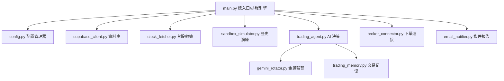

# AIAutoStocks - AI 台股自動量化交易排程引擎

[](https://www.python.org/)
[](https://supabase.com/)
[](https://ai.google.dev/)

`AIAutoStocks` 是一個基於 Large Language Model (LLM - Google Gemini API) 與 Supabase 的台股自動化量化交易排程系統。它能自動擷取台股歷史 K 線，結合「交易記憶與經驗管理器（Few-Shot Learning）」，由 AI 生成具備具體原因說明的交易決策（買入、賣出、觀望），並在交易完成後發送精美的 HTML 每日郵件報告。

系統設計支持**實時交易/模擬盤（Live Trading）**以及**歷史數據沙盒回測演練（Sandbox Simulation）**兩大模式。

---

## 🏗️ 系統架構與特色

本專案採用高度模組化的架構設計，各組件分工明確：



### 🌟 核心特色
1. **多 Gemini API 金鑰輪替與冷卻機制 (`gemini_rotator.py`)**：
   支援多組免費的 Gemini API 金鑰自動輪替。當某金鑰觸發 429 限制（RPM/RPD）時，系統會自動將其標記為冷卻，並切換至其他可用金鑰，確保決策流暢不中斷。
2. **Few-Shot 交易記憶管理器 (`trading_memory.py`)**：
   自 Supabase 讀取過往的交易損益，自動篩選高收益的「成功交易」與虧損的「失敗交易」作為經驗背景，動態注入 AI Prompt，使 AI 能從歷史經驗中學習。
3. **無縫切換的數據模擬窗口 (`sandbox_simulator.py`)**：
   在 `--mode sandbox` 下，模擬器會凍結真實帳戶與資金，利用 Supabase 的歷史 K 線重播行情。交易決策引擎與下單系統無需修改任何程式碼即可直接進行回測。
4. **安全憑證解密管理器 (`credential_manager.py`)**：
   利用 AES-256-GCM 演算法對敏感憑證（如真實券商憑證、API 密鑰）進行本機加密保存 (`credentials.enc`)，執行時透過環境變數傳入解密主密鑰 (`MASTER_KEY`)，確保憑證不外洩。
5. **交易限額安全防呆機制 (`broker_connector.py`)**：
   實作單筆交易限額、每日交易總額超限防護、防重複下單鎖定，避免因程式異常造成重大資金損失。
6. **精美響應式 HTML 郵件報告 (`email_notifier.py`)**：
   使用符合移動端閱讀的 Inline-CSS HTML 郵件，每日收盤結算後自動發送當日帳戶淨值、持股狀態與 AI 預測。

---

## 📁 檔案目錄結構

```text
AIAutoStocks/
├── src/
│   ├── agents/
│   │   └── trading_agent.py       # AI 交易決策代理 (Prompt 工程與 JSON Schema 輸出)
│   ├── services/
│   │   ├── broker_connector.py    # 證券商下單連接器 (防呆與超限防護)
│   │   ├── credential_manager.py  # 安全憑證與金鑰管理器 (AES-GCM 解密)
│   │   ├── email_notifier.py      # HTML 每日報告發送器
│   │   ├── gemini_rotator.py      # Gemini API 金鑰輪替與冷卻重試
│   │   ├── sandbox_simulator.py   # 沙盒回測演練與歷史數據重播
│   │   ├── stock_fetcher.py       # 台股數據擷取器 (K線與即時報價)
│   │   ├── supabase_client.py     # Supabase 連線與 CRUD 封裝
│   │   └── trading_memory.py      # 交易記憶與經驗管理器
│   ├── config.py                  # 配置與環境變數驗證器
│   └── main.py                    # 系統總入口/命令列排程引擎
├── tests/                         # 單元測試 (pytest)
├── config.json                    # 本機外部配置檔 (不提交敏感金鑰)
├── config.example.json            # 外部配置檔範本
├── Dockerfile                     # 容器部署配置
├── requirements.txt               # 專案依賴套件
├── main.py                        # 根目錄執行檔入口 (簡化指令)
├── README.md                      # 專案說明文件
```

---

## 🛠️ 安裝與快速開始

### 1. 複製專案與安裝套件
請確保安裝了 **Python 3.10** 以上版本：
```bash
git clone https://github.com/your-repo/AIAutoStocks.git
cd AIAutoStocks
pip install -r requirements.txt
```

### 2. 配置設定檔 (`config.json`)
將根目錄下的 `config.example.json` 複製並命名為 `config.json`，然後填入您的設定：
```json
{
  "SUPABASE_URL": "https://your-project-id.supabase.co",
  "SUPABASE_KEY": "your-supabase-anon-or-service-role-key",
  "GEMINI_API_KEYS": "KEY_1,KEY_2,KEY_3",
  "MASTER_KEY": "your-decryption-master-key",
  "GMAIL_USER": "your-email@gmail.com",
  "GMAIL_APP_PASSWORD": "your-gmail-app-password",
  "EMAIL_TO": "receiver-email@gmail.com",
  "TRADING_LIMIT_SINGLE_STOCK": 50000.0,
  "TRADING_LIMIT_DAILY_TOTAL": 150000.0,
  "PAPER_TRADING_MODE": "true",
  "TAIWAN_STOCK_TIMEZONE": "Asia/Taipei",
  "CREDENTIALS_FILE_PATH": "credentials.enc"
}
```
> [!IMPORTANT]
> - `GEMINI_API_KEYS` 可輸入多個金鑰，請以英文逗號 `,` 隔開。
> - `GMAIL_APP_PASSWORD` 為 Gmail 的「應用程式密碼」（需先開啟 Google 帳號的雙重驗證）。

### 3. 配置安全憑證與加密檔案 (`credentials.enc`)
為了避免將敏感帳密（如永豐證券 Shioaji API Key、身分證字號、CA 憑證密碼等）以明文形式暴露或提交至 Git 倉庫，本專案提供了一個憑證加密工具。

#### 步驟：
1. **複製憑證範本**：
   將專案根目錄的 `credentials.example.json` 複製並命名為 `credentials.json`：
   ```bash
   cp credentials.example.json credentials.json
   ```
2. **填寫真實憑證**：
   開啟 `credentials.json`，填入您的真實 `geminiApiKeys` 與 `brokerCredentials` (Shioaji API Key、金鑰、憑證密碼及身分證字號等)。
3. **執行加密工具**：
   執行加密腳本，將 `credentials.json` 使用 `config.json` 中的 `MASTER_KEY` 加密為安全憑證檔 `credentials.enc`：
   ```bash
   python encrypt_credentials.py
   ```
   加密完畢後，腳本會詢問您是否要刪除明文的 `credentials.json`，請輸入 `y` 確認刪除以策安全。

> [!WARNING]
> - `credentials.json` 含有敏感帳密，已被設定在 `.gitignore` 中以防止意外提交，請勿將其公開或上傳。
> - 在 Fly.io 等雲端部署時，若要使用安全憑證，需將 `credentials.enc` 檔案放進部署目錄中，並將 `MASTER_KEY` 環境變數配置妥當，系統便會於啟動時自動解密載入。

### 4. Supabase 資料庫建置
請在您的 Supabase 專案中，前往 **SQL Editor** 執行以下 SQL 語法以建立所需的資料表：
<details>
<summary>點擊展開 SQL 建表語法</summary>

```sql
-- 1. Gemini API 金鑰狀態表
CREATE TABLE IF NOT EXISTS gemini_keys_state (
    key_hash TEXT PRIMARY KEY,
    use_count INTEGER DEFAULT 0,
    rpm_limit INTEGER DEFAULT 15,
    rpd_limit INTEGER DEFAULT 1500,
    last_used_at TIMESTAMP WITH TIME ZONE,
    cooled_until TIMESTAMP WITH TIME ZONE
);

-- 2. 台股 K 線數據表
CREATE TABLE IF NOT EXISTS stock_klines (
    stock_code TEXT NOT NULL,
    date TEXT NOT NULL,
    open NUMERIC NOT NULL,
    high NUMERIC NOT NULL,
    low NUMERIC NOT NULL,
    close NUMERIC NOT NULL,
    volume BIGINT NOT NULL,
    updated_at TIMESTAMP WITH TIME ZONE DEFAULT timezone('utc'::text, now()),
    PRIMARY KEY (stock_code, date)
);

-- 3. 持股明細表
CREATE TABLE IF NOT EXISTS holdings (
    id BIGINT GENERATED BY DEFAULT AS IDENTITY PRIMARY KEY,
    stock_code TEXT NOT NULL,
    quantity NUMERIC NOT NULL DEFAULT 0,
    average_price NUMERIC NOT NULL DEFAULT 0,
    is_paper BOOLEAN NOT NULL DEFAULT TRUE,
    updated_at TIMESTAMP WITH TIME ZONE DEFAULT timezone('utc'::text, now()),
    CONSTRAINT holdings_stock_paper_unique UNIQUE (stock_code, is_paper)
);

-- 4. 交易訂單表
CREATE TABLE IF NOT EXISTS trade_orders (
    id BIGINT GENERATED BY DEFAULT AS IDENTITY PRIMARY KEY,
    stock_code TEXT NOT NULL,
    action TEXT NOT NULL, -- 'BUY' 或 'SELL'
    price NUMERIC NOT NULL,
    quantity NUMERIC NOT NULL,
    fee NUMERIC NOT NULL DEFAULT 0,
    total_amount NUMERIC NOT NULL,
    realized_pnl NUMERIC NOT NULL DEFAULT 0,
    is_paper BOOLEAN NOT NULL DEFAULT TRUE,
    executed_at TIMESTAMP WITH TIME ZONE DEFAULT timezone('utc'::text, now())
);

-- 5. 系統運行日誌表
CREATE TABLE IF NOT EXISTS system_logs (
    id BIGINT GENERATED BY DEFAULT AS IDENTITY PRIMARY KEY,
    level TEXT NOT NULL, -- 'INFO', 'WARN', 'ERROR'
    message TEXT NOT NULL,
    details JSONB DEFAULT '{}'::jsonb,
    created_at TIMESTAMP WITH TIME ZONE DEFAULT timezone('utc'::text, now())
);
```
</details>

---

## 🚀 執行模式說明

### 1. 實時交易/模擬盤模式 (Live Trading Mode)
實時獲取目標股票的最新歷史 K 線並儲存至 Supabase，接著呼叫 AI 決策代理生成交易訊號，並執行下單。
此模式內建**跳過週末非交易日**的邏輯，適合設定為每日 Cron 排程（如配合 Fly.io 或 Github Actions）。

```bash
# 預設模式（以台積電 2330、聯發科 2454 為例）
python main.py --mode live --stocks 2330,2454
```

### 2. 沙盒歷史回測模擬模式 (Sandbox Mode)
此模式會根據您指定的起訖時間，重播 Supabase 中已持久化的歷史 K 線資料，以測試 AI 的交易決策表現與收益率。所有訂單及持股變動均會寫入帶有 `is_paper = true` 的資料表中，且不會觸發真實下單 API。

```bash
# 執行 2026/06/01 至 2026/06/08 的歷史數據沙盒演練
python main.py --mode sandbox --stocks 2330,2454 --start-date 2026-06-01 --end-date 2026-06-08
```
> [!TIP]
> 進行沙盒演練前，請確保 Supabase 中已存有該時段的 K 線數據（可在 `live` 模式下先執行過一次，系統會自動下載並儲存最新的日 K 線歷史）。

---

## 🧪 單元測試
專案使用 `pytest` 進行測試，執行以下指令以執行系統測試：
```bash
pytest
```

---

## 🐳 Docker 部署 (以 Fly.io 為例)
本專案已備妥 `Dockerfile` 並預設安裝 `tzdata` 以設定台灣時區 (UTC+8)。

要在 **Fly.io** 上部署：
1. 配置 Fly.io app：
   ```bash
   fly launch
   ```
2. 將 `config.json` 的全部內容作為 Secret 環境變數傳入：
   ```bash
   fly secrets set CONFIG_JSON="$(cat config.json)"
   ```
3. 設定每日盤後定時執行排程任務。
