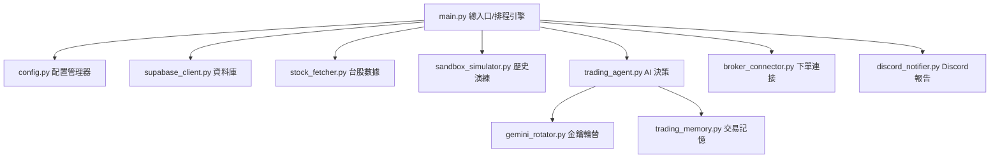

# AIAutoStocks - AI 台股自動量化交易排程引擎

[](https://www.python.org/)
[](https://supabase.com/)
[](https://ai.google.dev/)

`AIAutoStocks` 是一個基於 Large Language Model (LLM - Google Gemini API) 與 Supabase 的台股自動化量化交易排程系統。它能自動擷取台股歷史 K 線，結合「交易記憶與經驗管理器（Few-Shot Learning）」，由 AI 生成具備具體原因說明的交易決策（買入、賣出、觀望），並在交易完成後發送精美的 HTML 每日郵件報告。

系統設計支持**實時交易/模擬盤（Live Trading）**以及**歷史數據沙盒回測演練（Sandbox Simulation）**兩大模式。

---

## 🏗️ 系統架構與特色

本專案採用高度模組化的架構設計，各組件分工明確：



### 🌟 核心特色
1. **多 Gemini API 金鑰輪替與冷卻機制 (`gemini_rotator.py`)**：
   支援多組免費的 Gemini API 金鑰自動輪替。當某金鑰觸發 429 限制（RPM/RPD）時，系統會自動將其標記為冷卻，並切換至其他可用金鑰，確保決策流暢不中斷。
2. **Few-Shot 交易記憶管理器 (`trading_memory.py`)**：
   自 Supabase 讀取過往的交易損益，自動篩選高收益的「成功交易」與虧損的「失敗交易」作為經驗背景，動態注入 AI Prompt，使 AI 能從歷史經驗中學習。
3. **無縫切換的數據模擬窗口 (`sandbox_simulator.py`)**：
   在 `--mode sandbox` 下，模擬器會凍結真實帳戶與資金，利用 Supabase 的歷史 K 線重播行情。交易決策引擎與下單系統無需修改任何程式碼即可直接進行回測。
4. **安全憑證解密管理器 (`credential_manager.py`)**：
   利用 AES-256-GCM 演算法對敏感憑證（如真實券商憑證、API 密鑰）進行本機加密保存 (`credentials.enc`)，執行時透過環境變數傳入解密主密鑰 (`MASTER_KEY`)，確保憑證不外洩。
5. **交易限額安全防呆機制 (`broker_connector.py`)**：
   實作單筆交易限額、每日交易總額超限防護、防重複下單鎖定，避免因程式異常造成重大資金損失。
6. **精美 Discord Webhook 報告 (`discord_notifier.py`)**：
   使用富文本 Rich Embed 格式將每日報告發送至 Discord，包含當日交易盈虧、持股狀態與 AI 預測。

---

## 📁 檔案目錄結構

```text
AIAutoStocks/
├── src/
│   ├── agents/
│   │   └── trading_agent.py       # AI 交易決策代理 (Prompt 工程與 JSON Schema 輸出)
│   ├── services/
│   │   ├── broker_connector.py    # 證券商下單連接器 (防呆與超限防護)
│   │   ├── credential_manager.py  # 安全憑證與金鑰管理器 (AES-GCM 解密)
│   │   ├── discord_notifier.py    # Discord 每日報告與警報發送器
│   │   ├── gemini_rotator.py      # Gemini API 金鑰輪替與冷卻重試
│   │   ├── sandbox_simulator.py   # 沙盒回測演練與歷史數據重播
│   │   ├── stock_fetcher.py       # 台股數據擷取器 (K線與即時報價)
│   │   ├── supabase_client.py     # Supabase 連線與 CRUD 封裝
│   │   └── trading_memory.py      # 交易記憶與經驗管理器
│   ├── config.py                  # 配置與環境變數驗證器
│   └── main.py                    # 系統總入口/命令列排程引擎
├── tests/                         # 單元測試 (pytest)
├── config.json                    # 本機外部配置檔 (不提交敏感金鑰)
├── config.example.json            # 外部配置檔範本
├── Dockerfile                     # 容器部署配置
├── requirements.txt               # 專案依賴套件
├── main.py                        # 根目錄執行檔入口 (簡化指令)
├── README.md                      # 專案說明文件
```

---

## 🛠️ 安裝與快速開始

### 1. 複製專案與安裝套件
請確保安裝了 **Python 3.10** 以上版本：
```bash
git clone https://github.com/your-repo/AIAutoStocks.git
cd AIAutoStocks
pip install -r requirements.txt
```

### 2. 配置系統設定檔 (`config.json`)
將根目錄下的 `config.example.json` 複製並命名為 `config.json`，然後填入您的網頁 UI 與系統參數設定：
```json
{
  "GEMINI_MODEL": "gemini-1.5-flash",
  "MASTER_KEY": "your-secure-passphrase-to-decrypt-credentials-file",
  "TRADING_LIMIT_SINGLE_STOCK_PCT": 0.05,
  "TRADING_LIMIT_DAILY_TOTAL_PCT": 0.15,
  "INITIAL_CASH": 1000000.0,
  "PAPER_TRADING_MODE": "true",
  "TAIWAN_STOCK_TIMEZONE": "Asia/Taipei",
  "CREDENTIALS_FILE_PATH": "credentials.enc",
  "SANDBOX_START_DATE": "2026-05-01",
  "SANDBOX_END_DATE": "2026-06-08"
}
```
> [!IMPORTANT]
> - `config.json` 只保留供前端網頁 UI 調整的安全防呆與模擬參數，敏感的資安金鑰已徹底抽離至加密憑證檔。
> - `MASTER_KEY` 為您自訂的解密主密鑰，用於在系統啟動時解密您的敏感憑證。

### 3. 配置安全憑證與加密檔案 (`credentials.enc`)
為了確保真實帳密（如 Supabase 金鑰、Gmail 密碼、Gemini 多組 API Key、永豐證券 Shioaji API Key、身分證字號、CA 憑證密碼等）不外洩或被意外提交至 Git 倉庫，本系統提供憑證加密機制。

#### 步驟：
1. **複製憑證範本**：
   將專案根目錄的 `credentials.example.json` 複製並命名為 `credentials.json`：
   ```bash
   cp credentials.example.json credentials.json
   ```
2. **填寫真實憑證**：
   開啟 `credentials.json`，填入您的真實敏感設定：
   ```json
   {
     "geminiApiKeys": [
       "your-gemini-api-key-1",
       "your-gemini-api-key-2"
     ],
     "supabase": {
       "url": "https://your-project-id.supabase.co",
       "key": "your-supabase-anon-or-service-role-key"
     },
      "discord": {
        "webhookSandbox": "https://discord.com/api/webhooks/your-sandbox-webhook-url-here",
        "webhookLive": "https://discord.com/api/webhooks/your-live-webhook-url-here"
      },
     "brokerCredentials": {
       "apiId": "your-sinopac-api-id",
       "apiSecret": "your-sinopac-api-secret",
       "password": "your-ca-certificate-password",
       "certificatePath": "path/to/your/sinopac_ca_cert.pfx",
       "personId": "your-taiwan-id"
     }
   }
   ```
3. **執行加密工具**：
   執行加密腳本，將 `credentials.json` 使用 `config.json` 中的 `MASTER_KEY` 加密為安全憑證檔 `credentials.enc`：
   ```bash
   python encrypt_credentials.py
   ```
   加密完畢後，腳本會詢問您是否要刪除明文的 `credentials.json`，請輸入 `y` 確認刪除以策安全。

> [!WARNING]
> - 明文的 `credentials.json` 含有敏感帳密，已自動被加入 `.gitignore` 與 `.dockerignore`，**請絕對不要將其公開或上傳**。
> - 加密後的 `credentials.enc` 可安全地伴隨代碼上傳或部署。系統啟動時會讀取配置並動態解密合併至記憶體中。


### 4. Supabase 資料庫建置
請在您的 Supabase 專案中，前往 **SQL Editor** 執行以下 SQL 語法以建立所需的資料表：
請在您的 Supabase 專案中，前往 **SQL Editor** 執行專案根目錄下 [supabase_schema.sql](file:///Users/jpopaholic/Documents/AIAutoStocks/supabase_schema.sql) 的全部內容，以建立以下 7 張資料表、對應的加速查詢索引與初始設定值：

1. `watchlist` — 自選監控股票清單（支援 Upsert）
2. `holdings` — 目前持股明細（支援 Paper Trading / 實盤劃分）
3. `trade_orders` — 交易訂單歷史紀錄
4. `stock_klines` — 股票歷史日 K 線數據
5. `system_logs` — 系統運行日誌
6. `system_config` — 動態系統配置參數（提供網頁前端進行動態覆蓋）
7. `gemini_keys_state` — Gemini API 金鑰輪替與冷卻狀態

<details>
<summary>點擊展開完整的 SQL 建表與初始化語法</summary>

```sql
-- =============================================================================
-- AIAutoStocks — Supabase 完整資料庫 Schema
-- 請在 Supabase 後台 → SQL Editor 中執行此檔案
-- =============================================================================

-- -----------------------------------------------------------------------------
-- 1. watchlist — 自選監控股票清單
-- -----------------------------------------------------------------------------
CREATE TABLE IF NOT EXISTS watchlist (
    id          BIGSERIAL PRIMARY KEY,
    stock_code  TEXT NOT NULL UNIQUE,   -- 4 碼股票代號，唯一鍵（支援 upsert）
    created_at  TIMESTAMPTZ NOT NULL DEFAULT NOW()
);

-- 加速查詢索引
CREATE INDEX IF NOT EXISTS idx_watchlist_stock_code ON watchlist (stock_code);

-- 啟用 Row Level Security（建議，但 service role key 可繞過）
ALTER TABLE watchlist ENABLE ROW LEVEL SECURITY;
CREATE POLICY "service role full access" ON watchlist
    USING (true) WITH CHECK (true);

-- 初始測試資料（可選，執行後可從前端刪除）
-- INSERT INTO watchlist (stock_code) VALUES ('2330'), ('2454') ON CONFLICT DO NOTHING;


-- -----------------------------------------------------------------------------
-- 2. holdings — 目前持股明細
-- -----------------------------------------------------------------------------
CREATE TABLE IF NOT EXISTS holdings (
    id            BIGSERIAL PRIMARY KEY,
    stock_code    TEXT NOT NULL,
    quantity      NUMERIC(18, 4) NOT NULL DEFAULT 0,
    average_price NUMERIC(18, 4) NOT NULL DEFAULT 0,
    is_paper      BOOLEAN NOT NULL DEFAULT TRUE,   -- TRUE=沙盒模擬, FALSE=實盤
    updated_at    TIMESTAMPTZ NOT NULL DEFAULT NOW(),
    UNIQUE (stock_code, is_paper)                  -- 支援 upsert on_conflict
);

CREATE INDEX IF NOT EXISTS idx_holdings_stock_code ON holdings (stock_code);
CREATE INDEX IF NOT EXISTS idx_holdings_is_paper   ON holdings (is_paper);

ALTER TABLE holdings ENABLE ROW LEVEL SECURITY;
CREATE POLICY "service role full access" ON holdings
    USING (true) WITH CHECK (true);


-- -----------------------------------------------------------------------------
-- 3. trade_orders — 交易訂單歷史紀錄
-- -----------------------------------------------------------------------------
CREATE TABLE IF NOT EXISTS trade_orders (
    id            BIGSERIAL PRIMARY KEY,
    stock_code    TEXT NOT NULL,
    action        TEXT NOT NULL CHECK (action IN ('BUY', 'SELL')),
    price         NUMERIC(18, 4) NOT NULL,
    quantity      NUMERIC(18, 4) NOT NULL,
    fee           NUMERIC(18, 4) NOT NULL DEFAULT 0,
    total_amount  NUMERIC(18, 4) NOT NULL,
    realized_pnl  NUMERIC(18, 4) NOT NULL DEFAULT 0,
    is_paper      BOOLEAN NOT NULL DEFAULT TRUE,
    executed_at   TIMESTAMPTZ NOT NULL DEFAULT NOW()
);

CREATE INDEX IF NOT EXISTS idx_trade_orders_stock_code   ON trade_orders (stock_code);
CREATE INDEX IF NOT EXISTS idx_trade_orders_executed_at  ON trade_orders (executed_at DESC);
CREATE INDEX IF NOT EXISTS idx_trade_orders_is_paper     ON trade_orders (is_paper);

ALTER TABLE trade_orders ENABLE ROW LEVEL SECURITY;
CREATE POLICY "service role full access" ON trade_orders
    USING (true) WITH CHECK (true);


-- -----------------------------------------------------------------------------
-- 4. stock_klines — 股票歷史 K 線數據
-- -----------------------------------------------------------------------------
CREATE TABLE IF NOT EXISTS stock_klines (
    id          BIGSERIAL PRIMARY KEY,
    stock_code  TEXT NOT NULL,
    date        DATE NOT NULL,
    open        NUMERIC(18, 4),
    high        NUMERIC(18, 4),
    low         NUMERIC(18, 4),
    close       NUMERIC(18, 4),
    volume      BIGINT,
    updated_at  TIMESTAMPTZ NOT NULL DEFAULT NOW(),
    UNIQUE (stock_code, date)                     -- 支援 upsert on_conflict
);

CREATE INDEX IF NOT EXISTS idx_stock_klines_stock_date ON stock_klines (stock_code, date DESC);

ALTER TABLE stock_klines ENABLE ROW LEVEL SECURITY;
CREATE POLICY "service role full access" ON stock_klines
    USING (true) WITH CHECK (true);


-- -----------------------------------------------------------------------------
-- 5. system_logs — 系統執行日誌（自動 TTL 清理 7 天）
-- -----------------------------------------------------------------------------
CREATE TABLE IF NOT EXISTS system_logs (
    id         BIGSERIAL PRIMARY KEY,
    level      TEXT NOT NULL DEFAULT 'INFO',   -- INFO / WARN / ERROR
    message    TEXT NOT NULL,
    details    JSONB,
    created_at TIMESTAMPTZ NOT NULL DEFAULT NOW()
);

CREATE INDEX IF NOT EXISTS idx_system_logs_created_at ON system_logs (created_at DESC);
CREATE INDEX IF NOT EXISTS idx_system_logs_level      ON system_logs (level);

ALTER TABLE system_logs ENABLE ROW LEVEL SECURITY;
CREATE POLICY "service role full access" ON system_logs
    USING (true) WITH CHECK (true);


-- -----------------------------------------------------------------------------
-- 6. system_config — 動態系統配置參數（key-value 形式）
-- -----------------------------------------------------------------------------
CREATE TABLE IF NOT EXISTS system_config (
    id         BIGSERIAL PRIMARY KEY,
    key        TEXT NOT NULL UNIQUE,
    value      TEXT NOT NULL,
    updated_at TIMESTAMPTZ NOT NULL DEFAULT NOW()
);

CREATE INDEX IF NOT EXISTS idx_system_config_key ON system_config (key);

ALTER TABLE system_config ENABLE ROW LEVEL SECURITY;
CREATE POLICY "service role full access" ON system_config
    USING (true) WITH CHECK (true);

-- 預設動態配置初始值（可從前端覆蓋）
INSERT INTO system_config (key, value) VALUES
    ('PAPER_TRADING_MODE',           'true'),
    ('INITIAL_CASH',                 '1000000'),
    ('TRADING_LIMIT_SINGLE_STOCK_PCT', '0.1'),
    ('TRADING_LIMIT_DAILY_TOTAL_PCT',  '0.3'),
    ('SANDBOX_START_DATE',           '2026-05-01'),
    ('SANDBOX_END_DATE',             '2026-06-09'),
    ('GEMINI_MODEL',                 'gemini-1.5-flash'),
    ('AUTO_TRADING_ACTIVE',          'true'),
    ('TAIWAN_STOCK_TIMEZONE',        'Asia/Taipei')
ON CONFLICT (key) DO NOTHING;


-- -----------------------------------------------------------------------------
-- 7. gemini_keys_state — Gemini API 金鑰輪替狀態
-- -----------------------------------------------------------------------------
CREATE TABLE IF NOT EXISTS gemini_keys_state (
    id           BIGSERIAL PRIMARY KEY,
    key_hash     TEXT NOT NULL UNIQUE,   -- API key 的 SHA256 雜湊（不儲存明文）
    use_count    INTEGER NOT NULL DEFAULT 0,
    rpm_limit    INTEGER NOT NULL DEFAULT 15,
    rpd_limit    INTEGER NOT NULL DEFAULT 1500,
    last_used_at TIMESTAMPTZ,
    cooled_until TIMESTAMPTZ
);

CREATE INDEX IF NOT EXISTS idx_gemini_keys_key_hash ON gemini_keys_state (key_hash);

ALTER TABLE gemini_keys_state ENABLE ROW LEVEL SECURITY;
CREATE POLICY "service role full access" ON gemini_keys_state
    USING (true) WITH CHECK (true);
```
</details>

---

## 🚀 執行模式說明

### 1. 實時交易/模擬盤模式 (Live Trading Mode)
實時獲取目標股票的最新歷史 K 線並儲存至 Supabase，接著呼叫 AI 決策代理生成交易訊號，並執行下單。
此模式內建**跳過週末非交易日**的邏輯，適合設定為每日 Cron 排程（如配合 Fly.io 或 Github Actions）。

```bash
# 預設模式（以台積電 2330、聯發科 2454 為例）
python main.py --mode live --stocks 2330,2454
```

### 2. 沙盒歷史回測模擬模式 (Sandbox Mode)
此模式會根據您指定的起訖時間，重播 Supabase 中已持久化的歷史 K 線資料，以測試 AI 的交易決策表現與收益率。所有訂單及持股變動均會寫入帶有 `is_paper = true` 的資料表中，且不會觸發真實下單 API。

```bash
# 執行 2026/06/01 至 2026/06/08 的歷史數據沙盒演練
python main.py --mode sandbox --stocks 2330,2454 --start-date 2026-06-01 --end-date 2026-06-08
```
> [!TIP]
> 進行沙盒演練前，請確保 Supabase 中已存有該時段的 K 線數據（可在 `live` 模式下先執行過一次，系統會自動下載並儲存最新的日 K 線歷史）。

### 3. 一鍵下車/清空持股模式 (Liquidate Mode)
此模式會立即獲取當前帳戶模式下的所有持股倉位（若 `PAPER_TRADING_MODE` 為 `true` 則清空模擬持股；為 `false` 則清空真實實盤持股），並自動獲取最新盤中即時報價（若非交易時間則使用歷史最新收盤價），對每檔股票送出 `SELL` 委託進行平倉，實現一鍵下車防禦。

```bash
# 執行一鍵下車清空持股
python main.py --mode liquidate
```

---

## 🧪 單元測試
專案使用 `pytest` 進行測試，執行以下指令以執行系統測試：
```bash
pytest
```

---

## 🐳 Docker 部署 (以 Fly.io 為例)
本專案已備妥 `Dockerfile` 並預設安裝 `tzdata` 以設定台灣時區 (UTC+8)。

要在 **Fly.io** 上部署：
1. 配置 Fly.io app：
   ```bash
   fly launch
   ```
2. 將包含解密主金鑰 `MASTER_KEY` 的 `config.json` 的全部內容作為 Secret 環境變數傳入：
   ```bash
   fly secrets set CONFIG_JSON="$(cat config.json)"
   ```
   > [!IMPORTANT]
   > - 由於 `credentials.enc` 檔案為安全加密格式，它已在 `Dockerfile` 中設定隨代碼一同打包部署至容器中。
   > - 容器啟動時，系統會自動使用從 Secrets 傳入的 `MASTER_KEY` 對容器內的 `credentials.enc` 進行解密，並載入 Supabase、Discord 及永豐證券等連線帳密，無須額外設定明文變數。
3. 設定每日盤後定時執行排程任務。
