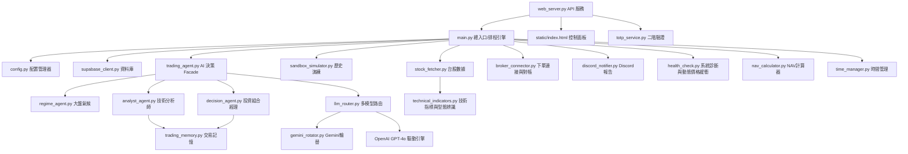

# AIAutoStocks - AI 台股自動量化交易排程引擎

[](https://www.python.org/)
[](https://supabase.com/)
[](https://ai.google.dev/)
[](https://fly.io/)

> [!CAUTION]
> ### ⚠️ 免責聲明 (Disclaimer)
> 
> 1. **技術研究與學習交流**：本專案（`AIAutoStocks`）僅供**技術研究、程式開發、量化交易實驗與學習交流用途**。專案**不提供代客操作、不管理使用者資金、不代替使用者做出投資決策**。
> 2. **模型輸出結果定位**：專案內產出之 AI 分析、評分與 **BUY / SELL / HOLD** 等訊號僅代表模型輸出結果，**均不構成任何形式之投資諮詢、財務建議或買賣推薦**。
> 3. **獨立部署與實盤責任**：本專案採用自主部署架構（Own Supabase & Broker API）。**啟用 Live Trading 前，請確認交易帳戶、API 設定與風險控制措施。**
> 4. **完整條款說明**：有關違約交割責任、槓桿風險與法律免責聲明之完整細節，請參閱 [DISCLAIMER.md](DISCLAIMER.md)。

`AIAutoStocks` 是一個基於 Large Language Model (LLM - 支持 Google Gemini API 與 OpenAI GPT-4o 雙引擎) 與 Supabase 的台股自動化量化交易與排程控制系統。系統採用多層級 AI 決策架構，結合「交易記憶與經驗管理器（Few-Shot Learning）」與「月度戰術 Skills 自主演化機制」，自動擷取台股歷史日 K 線與技術指標，生成具備詳細理據與風控護欄的交易決策。

系統支援**實盤交易 / 模擬交易 (Live Trading / Paper Trading)**、**永豐沙盒模擬交易 (Shioaji Simulation)**、**歷史數據沙盒回測演練 (Sandbox Simulation)**、**雙向動態價格緩衝 (Price Buffer & Dynamic Liquidation)**，並配備一個具備 TOTP 二階段驗證與控制介面的**網頁控制台儀表板 (FastAPI Web Server)**，方便即時追蹤損益、監控日誌與控制交易流程。

---

## 🏗️ 系統架構與核心特色

本專案採用高度模組化、多層級 AI 代理與護欄防衛架構設計：


```mermaid
graph TD
    A[main.py 總入口/排程引擎] --> B[config.py 配置管理器]
    A --> C[supabase_client.py 資料庫]
    A --> D[stock_fetcher.py 台股數據]
    A --> E[sandbox_simulator.py 歷史演練]
    A --> F[trading_agent.py AI 決策 Facade]
    
    W[web_server.py API 服務] --> A
    W --> H1[static/index.html 控制面板]
    W --> T[totp_service.py 二階驗證]
    
    F --> F1[regime_agent.py 大盤氣候]
    F --> F2[analyst_agent.py 技術分析師]
    F --> F3[decision_agent.py 投資組合經理]
    
    F --> LR[llm_router.py 多模型路由]
    LR --> G[gemini_rotator.py Gemini輪替]
    LR --> OA[OpenAI GPT-4o 驅動引擎]
    
    F2 --> M[trading_memory.py 交易記憶]
    F3 --> M
    
    A --> I[broker_connector.py 下單連接與對帳]
    A --> J[discord_notifier.py Discord報告]
    A --> H2[health_check.py 系統診斷與動態價格緩衝]
    A --> N[nav_calculator.py NAV計算器]
    
    D --> TI[technical_indicators.py 技術指標與型態辨識]
    A --> TM[time_manager.py 時間管理]
```

### 🌟 核心特色

1. **🤖 多 LLM 模型提供者與智慧路由引擎 (`llm_router.py`)**：
   - 原生支援 **Google Gemini** (Gemini 1.5 / 2.0) 與 **OpenAI** (GPT-4o / GPT-4o-mini) 雙強驅動。
   - 可透過系統配置 `AI_PROVIDER` 設定為 `auto` (智慧自動優先偵測)、`openai` 或 `gemini`。
   - 具備統一 Structured Outputs (Pydantic / JSON Schema) 回傳、API 降級與自動備援切換機制。

2. **🌦️ 6階市場氣候與5階交易姿態動態風控 (`regime_agent.py`)**：
   - **六階市場狀態 (Regime)**：`STRONG_BULL` (強勢多頭), `REBOUND_BULL` (驚驚漲/震盪偏多), `CALM_RANGE` (低波動橫盤), `VOLATILE_RANGE` (高波動震盪), `CORRECTION_BEAR` (震盪修正), `PANIC_BEAR` (恐慌空頭)。
   - **五階交易姿態 (Posture)**：`STRONG_ATTACK` (強攻攻勢), `MODERATE_ATTACK` (穩健進攻), `CHOPPY_TACTICAL` (震盪靈活), `DEFENSIVE_ACCUMULATION` (防禦承接), `STRICT_DEFENSE` (極度保守)。
   - **連動姿態管理**：與建議目標現金儲備比例 ($5\%\sim 90\%$)、允許買進動作型態（如突破、拉回、防禦價值、零股防禦建倉）與動態風險限額乘數 ($0.15\sim 1.0$) 深度綁定，達成高感度大盤避險與部位控管。

3. **多層級 AI 智能決策管線**：
   - **第一層：大盤氣候診斷 (`regime_agent.py`)**：分析大盤加權指數 (TAIEX) 的走勢，判定當前氣候與交易姿態。
   - **第二層：技術分析師評分 (`analyst_agent.py`)**：為每檔股票在「趨勢、動能、成交量、安全防守、大盤一致性」五個維度進行量化評分 (0 ~ 20 分，滿分 100 分) 並生成技術分析原因。
   - **第三層：投資組合配置經理 (`decision_agent.py`)**：橫向對比所有分析個股，做出最終的交易建議 (BUY / SELL / HOLD)，並配合 Python 端的「水箱分配演算法 (Water-Filling)」在單股限額與每日交易上限內動態分配買入資金與股數。
   - **協調門面與故障防衛 (`trading_agent.py`)**：整合分析與決策管線，並在系統處於故障狀態 (SYSTEM FAULT) 時主動阻斷交易，實施安全避險。

4. **⚡ 雙向動態價格緩衝機制 (Price Slippage Buffer & Dynamic Liquidation)**：
   - **買進溢價追價 (BUY Premium Buffer)**：根據 AI 評定總分（$\ge 85$分 $+1.5\%$, $70\sim 84$分 $+1.0\%$, $<70$分 $+0.5\%$）自動計算高於參考價的委託上限，並通過台股升降單位 (Tick Size) 自動對齊，徹底解決開高跳空買不到 (Gap-Up execution miss) 的問題。同時買進股數精確以最高溢價限價計算，預算 100% 不超支。
   - **賣出/平倉折價讓價 (SELL Discount Buffer)**：風控賣出（$-1.0\%\sim -1.5\%$）與一鍵下車平倉（$-1.5\%$）自動計算低於基準價的限價委託下限，利用台股交易所「最佳買價優先撮合」機制，取得最高成交優先權，徹底解決開低跌勢賣不掉 (Gap-Down hanging sell orders) 的問題。

5. **🛡️ 嚴格 Python 硬核護欄防衛體系 (Multi-Layered Safeguards)**：
   - **同日對沖防護 (Anti-Churning Safeguard)**：同日已買進之股票當日禁止反向賣出；同日已賣出之股票當日禁止反向買回，避免高頻買賣與價差損耗。
   - **虧損平倉冷卻期 (Loss Cooldown Guard)**：當日內若賣出某檔股票且為虧損平倉 (`realized_pnl < 0`)，自動將該股列入冷卻名單 (`cooldown_stocks`)，當日禁止重新建倉。
   - **智慧平倉與等候佇列重寫 (Pending Liquidation Override)**：已進入平倉佇列之個股，即使 LLM 誤回傳 `BUY` 訊號，系統將強制校正為 `HOLD` 並清零股數，確保部位順利平倉。
   - **脈絡上下文護欄 (Context Guard)**：無持股庫存時強制過濾 LLM 輸出的「減碼/獲利落袋」等技能引用；總分達標時強制過濾「未達門檻」幻覺引用，確保理據 100% 精準可解釋。

6. **🔍 K 線轉折型態自動辨識與技能脈絡鎖 (`analyst_agent.py`)**：
   - 在技術分析師評分階段，自動計算 **V 型反彈機率 (`v_reversal_prob`)** 與 **A 頂誘多預警機率 (`a_top_prob`)**。
   - 若型態機率小於 50%，Python 護欄會強效過濾 LLM 輸出的 V 轉 / A 頂戰術引用，避免模型產生型態幻覺。

7. **📊 券商真實委託對帳與滑價統計計算 (`monthly_aggregator.py` & `broker_connector.py`)**：
   - 支援自動將資料庫 PENDING 狀態之訂單與永豐金證券 Shioaji 券商端即時委託狀態同步對帳 (`sync_broker_orders`)。
   - 月度復盤會自動算入實際成交價與委託估價之偏差率，計算出**平均滑價率 (Mean Slippage Ratio)** 與**標準差 (Std Deviation)**，呈現在 Discord 報告與 AI 復盤診斷中。

8. **🔢 數值 Overflow 與巨量字串防衛 (`config.py`)**：
   - 內建 `safe_int()` 與 `safe_float()` 防護機制，可防範巨量幻覺數字（如 LLM 回傳 4300+ 位數字）、`NaN`、`Inf` 與 `OverflowError`。
   - 自動解開 Python 3.11+ `sys.set_int_max_str_digits(0)` 位數上限，確保交易系統 7x24 高可用不崩潰。

9. **Web UI 儀表板控制台 (`web_server.py` & `src/static/index.html`)**：
   - 視覺化顯示當前帳戶資產淨值 (NAV)、現金餘額、持股庫存與各部位帳面損益。
   - 即時編輯監控自選股清單、系統參數（如初始資金、風控限額比例、AI_PROVIDER 模型引擎切換、模擬/實盤模式）。
   - 提供系統執行日誌 (system_logs) 檢視與手動觸發/停止 AI 交易排程。
   - 支援手動平倉解鎖、手動庫存對帳同步、以及手動解除全局系統故障鎖。
   - 預設綁定 `0.0.0.0:8080`，無縫相容 Fly.io 雲端容器部署。

10. **二階段驗證安全登入 (TOTP, `totp_service.py`)**：
    - 網頁端提供 TOTP 安全防衛。若未指定環境變數 `TOTP_SECRET`，系統會基於解密主密鑰 (`MASTER_KEY`) 自動生成一組穩定的 Base32 金鑰。
    - 登入時提示掃描 QR Code 綁定 Authenticator App，大幅提升遠端部署與雲端容器運作的安全性。

11. **雙時區與虛擬時間軸調度 (`time_manager.py`)**：
    - 內建台灣時間 (Asia/Taipei) 與 UTC 的日期區間轉換。
    - 支援在歷史模擬回測時，無縫凍結真實時間、改為驅動虛擬沙盒日期，使回測結果的時間戳與資料庫一致。

12. **運行前自檢與下單安全預檢 (`health_check.py`)**：
    - 啟動前進行系統健康檢查 (Pre-flight Diagnostics)，驗證 Supabase、LLM API、永豐證券 (實盤下) 連線是否順暢。
    - 下單前進行交易審查 (Pre-order Safety Audit)，嚴格比對台股漲跌幅限制 (±10%)、是否符合台股升降單位 (Tick Size)、以及是否超額。

13. **多 Gemini API 金鑰輪替與冷卻機制 (`gemini_rotator.py`)**：
    - 支援多組免費/付費的 Gemini API 金鑰自動輪替。當某金鑰觸發 429 限制（RPM/RPD）時，自動標記冷卻並切換至其他可用金鑰，確保決策不中斷。

14. **Few-Shot 交易記憶管理器 (`trading_memory.py`)**：
    - 自 Supabase 讀取過往平倉交易記錄，動態篩選出高收益的「成功交易」與虧損的「失敗交易」作為經驗背景注入 AI Prompt，供 AI 吸取歷史教訓。

15. **安全憑證解密管理器 (`credential_manager.py`)**：
    - 利用 AES-256-GCM 演算法將敏感憑證（Supabase Key、Discord Webhooks 網址、Gemini 多組 API Key、OpenAI API Key、證券商 API Key 等）加密保存於 `credentials.enc`。
    - 執行時透過環境變數傳入主密鑰 `MASTER_KEY` 於記憶體中解密，確保敏感憑證不外洩。

16. **精美 Discord Webhook 報告 (`discord_notifier.py`)**：
    - 使用富文本 Embed 格式將每日報告發送至 Discord，包含當日交易盈虧、持股狀態、氣候姿態與 AI 預測。

17. **月度與長週期 AI 復盤演化系統 (`monthly_review_agent.py` & `monthly_aggregator.py`)**：
    - 每月底或週末會自動/手動執行雙層 AI 復盤（Layer 1: 技術指標與打分診斷、Layer 2: 投資組合與倉位控制診斷）。
    - 匯整當月 K 線、指標偏斜、評分與平倉實績，提煉出結構化 JSON Skills（如 V 轉反彈型態、頂點轉折預警、打分校正規則、動態姿態選股側重），並寫入 Supabase `monthly_skills` 資料表。
    - 次月交易時系統會自動載入最新演化出的 Skills 規範，實現 AI 交易策略的自主進化與經驗傳承。
    - **前瞻規劃**：已預留月度 (`webhookMonthlyReview`)、季度 (`webhookQuarterlyReview`) 與年度 (`webhookYearlyReview`) 通知管道，遵循週六復盤日邊界跨度規範（季度 3 個月度復盤日跨度 / 年度 12 個月度復盤日跨度），無縫銜接未來戰略 Agent。

---

## 📁 檔案目錄結構

```text
AIAutoStocks/
├── src/
│   ├── agents/
│   │   ├── analyst_agent.py        # 技術分析師代理 (K線多維度評分、V轉/A頂型態辨識與指標分析)
│   │   ├── decision_agent.py       # 投資組合配置經理代理 (水箱預算分配、追價/讓價、同日防沖與風控護欄)
│   │   ├── monthly_review_agent.py # 月度 AI 復盤與 Skills 自我演化代理 (雙層復盤診斷)
│   │   ├── regime_agent.py        # 大盤氣候診斷代理 (6階Regime與5階Posture動態姿態判定)
│   │   └── trading_agent.py       # 雙層 Agent 管線門面 (Facade) 與故障鎖避險機制
│   ├── services/
│   │   ├── broker_connector.py    # 證券商下單連接器 (防呆、超限防護、Tick對齊、對帳同步與模擬下單)
│   │   ├── credential_manager.py  # 安全憑證與金鑰管理器 (AES-GCM 解密)
│   │   ├── discord_notifier.py    # Discord 每日報告與警報發送器
│   │   ├── gemini_rotator.py      # Gemini API 金鑰輪替與冷卻重試
│   │   ├── health_check.py        # 運行前診斷、價格緩衝計算與下單安全審查器
│   │   ├── llm_router.py          # 多 LLM 提供者路由引擎 (Gemini & OpenAI 雙驅動)
│   │   ├── monthly_aggregator.py  # 月度交易數據、滑價率與績效指標聚合計算器
│   │   ├── nav_calculator.py      # 資產淨值 (NAV) 計算與動態限額快取
│   │   ├── sandbox_simulator.py   # 沙盒回測演練與歷史行情重播器
│   │   ├── stock_fetcher.py       # 台股與大盤 K 線與即時報價擷取器
│   │   ├── supabase_client.py     # Supabase 連線與資料庫 CRUD 封裝
│   │   ├── technical_indicators.py# 價格/成交量指標計算器 (SMA, EMA, RSI, MACD, DMI, ADX)
│   │   ├── totp_service.py        # TOTP 驗證與 Session Token 管理服務
│   │   └── trading_memory.py      # 交易得失與經驗檢索管理器
│   ├── scratch/                   # 維護、診斷與測試腳本目錄
│   │   ├── tests/                 # 完整 pytest 單元測試套件 (含LLM路由、氣候診斷、價格緩衝、溢位防護)
│   │   │   ├── test_buy_sell_price_buffer.py # 雙向溢價/折價緩衝測試
│   │   │   ├── test_llm_router.py            # LLM 路由引擎測試
│   │   │   ├── test_regime_agent.py          # 大盤氣候與姿態判定測試
│   │   │   ├── test_hybrid_liquidation.py   # 智慧平倉與強退護欄測試
│   │   │   ├── test_risk_limit_alignment.py # 風險限額乘數與預算對齊測試
│   │   │   ├── test_numeric_overflow_safeguards.py # 數值防護測試
│   │   │   └── ...
│   │   ├── check_logs.py          # 系統運行日誌快速查詢工具
│   │   ├── check_orders.py        # 訂單委託狀態與歷史明細檢查工具
│   │   ├── check_relations.py     # daily_analysis 與個股評分外鍵關聯檢查器
│   │   ├── check_unfilled.py      # 未成交/滑價取消訂單明細檢查器
│   │   ├── cleanup_duplicates.py  # 資料庫重複資料與 K 線清理公用工具
│   │   ├── import_scores.py       # 歷史 AI 個股評分明細大量導入器
│   │   └── parse_reports.py       # Discord 報告解析與交易績效統計器
│   ├── static/
│   │   └── index.html             # Web Dashboard 控制台前端頁面 (支援 AI_PROVIDER 選單與手動對帳)
│   ├── config.py                  # 配置與環境變數驗證器 (safe_int/safe_float/Overflow防護)
│   ├── main.py                    # 系統總入口/命令列排程與下車引擎
│   ├── time_manager.py            # 時區與模擬/真實時間軸協調器
│   └── web_server.py              # FastAPI Web API 與背景排程/下車平倉服務
├── supabase_schema.sql            # Supabase 全套 SQL Schema 與初始化設定
├── config.json                    # 本機外部配置檔 (不提交敏感金鑰)
├── config.example.json            # 外部配置檔範本
├── credentials.enc                # 加密後的安全憑證檔案 (可安全上傳 Git)
├── credentials.example.json       # 敏感憑證設定檔範本
├── encrypt_credentials.py         # 憑證加密與解密測試工具
├── import_history.py              # 台股歷史 K 線批次下載與導入器
├── fly.toml                       # Fly.io 雲端容器部署配置
├── Dockerfile                     # 容器部署 Dockerfile
├── requirements.txt               # 專案依賴套件
├── main.py                        # 根目錄執行檔入口 (簡化 CLI 指令)
└── README.md                      # 專案說明文件
```

---

## 🛠️ 安裝與快速開始

### 1. 複製專案與安裝套件
請確保安裝了 **Python 3.10** 以上版本：
```bash
git clone https://github.com/your-repo/AIAutoStocks.git
cd AIAutoStocks
pip install -r requirements.txt
```

### 2. 配置系統設定檔 (`config.json`)
將根目錄下的 `config.example.json` 複製並命名為 `config.json`，然後填入您的系統與帳戶參數設定：
```json
{
  "AI_PROVIDER": "auto",
  "GEMINI_MODEL": "gemini-1.5-flash",
  "MASTER_KEY": "your-secure-passphrase-to-decrypt-credentials-file",
  "TRADING_LIMIT_SINGLE_STOCK_PCT": 0.05,
  "TRADING_LIMIT_DAILY_TOTAL_PCT": 0.15,
  "INITIAL_CASH": 1000000.0,
  "PAPER_TRADING_MODE": "true",
  "TAIWAN_STOCK_TIMEZONE": "Asia/Taipei",
  "CREDENTIALS_FILE_PATH": "credentials.enc",
  "SANDBOX_START_DATE": "2026-05-01",
  "SANDBOX_END_DATE": "2026-06-08"
}
```
> [!IMPORTANT]
> - `AI_PROVIDER`: 支援 `"auto"` (自動優選), `"openai"` (GPT-4o) 或 `"gemini"` (Gemini Flash/Pro)。
> - `config.json` 保留給無敏感資訊的安全防呆、時區與模擬起訖設定，敏感密鑰均抽離至加密憑證檔。
> - `MASTER_KEY` 為您的解密主密鑰，用於解密敏感憑證檔 (`credentials.enc`)，請務必設定複雜且安全的字串。

### 3. 配置安全憑證與加密檔案 (`credentials.enc`)
為了避免真實帳密（如 Supabase 密鑰、Discord Webhooks 網址、Gemini 多組 API Key、OpenAI API Key、證券商 API Key 等）意外上傳至 Git，系統提供憑證加密機制：

1. **複製憑證範本**：
   ```bash
   cp credentials.example.json credentials.json
   ```
2. **填寫真實憑證**：
   開啟 `credentials.json` 填入您的真實金鑰設定（包含 `geminiApiKeys` 陣列、`openaiApiKey`、`supabase`、`discord` 及 `brokerCredentials` 資訊）。
3. **執行加密工具**：
   ```bash
   python encrypt_credentials.py
   ```
   加密完成後會生成安全憑證檔 `credentials.enc`。腳本會詢問是否刪除明文 `credentials.json`，請確認刪除。

#### 🔑 證券商電子憑證 (`.pfx`) 的處理與自動打包
永豐金證券下單 (Shioaji) 在實盤交易時，必須使用電子憑證檔案（例如 `Sinopac.pfx`）。系統已針對此處理進行了安全與部署上的優化：

1. **本機配置與加密**：
   * 請向永豐金證券申請電子憑證，下載後置於**專案根目錄**下（例如 `Sinopac.pfx`）。
   * 專案的 `.gitignore` 已設定過濾 `*.pfx`，因此該憑證**絕對不會**被意外提交到 Git 儲存庫。
   * 在 `credentials.json` 中的 `"brokerCredentials"` 內，將 `"certificatePath"` 設定為憑證檔名或相對路徑（例如 `"Sinopac.pfx"`），並填寫正確的憑證密碼等資訊。
   * 執行 `python encrypt_credentials.py`，將密碼等敏感設定加密存入 `credentials.enc`。

2. **Docker / 雲端部署 (如 Fly.io) 自動打包與動態解讀**：
   * 專案的 `Dockerfile` 中已配置了條件式萬用複製指令：`COPY *.pf[x] ./`。
   * 當您在本地執行 `fly deploy`（或 `docker build`）時，若根目錄下存在 `.pfx` 憑證檔，Docker 建置流程會**自動將該憑證打包進容器的 `/app` 工作目錄**中。
   * 系統在容器內運行時，`broker_connector.py` 會自動讀取解密後設定檔中的 `"certificatePath"`，並具備容器內檔名與工作目錄的自動 Fallback 機制。

---

## 🚀 執行模式與指令說明

### 1. 實時交易/模擬盤模式 (Live Trading Mode)
實時獲取自選監控股票的最新歷史 K 線並儲存至 Supabase，接著呼叫 LLM 決策代理生成交易訊號，並執行下單。內建跳過週末非交易日邏輯，適合設定為每日 Cron 排程任務。

> [!NOTE]
> **自動定時排程機制**：
> - **執行時段**：系統在背景運行定時排程引擎（永動機），預設僅在每日 **15:00 - 17:00**（台灣時間，排除週末）自動觸發交易任務。
> - **預約單模式**：此時段證交所已發布今日完整的日 K 歷史數據，AI 將基於此數據進行分析判定，並向券商送出**次日交易預約單**。此舉可避免盤後零股交易（13:40 - 14:30）撮合率極低的流動性問題，排隊至隔日 9:00 開盤時段直接撮合，成交率極高。
> - **去重週期判定**：系統以每日台灣時間 **13:30** 作為去重的週期基準點（即每日 13:30 之後的執行均計為當日已分析，防止重複執行與下單）。

```bash
# 預設模式（以台積電 2330、聯發科 2454 為例）
python main.py --mode live --stocks 2330,2454
```

### 2. 沙盒歷史回測模擬模式 (Sandbox Mode)
根據您指定的起訖時間，重播 Supabase 中已儲存的歷史日 K 線資料，以測試 AI 的交易決策表現與收益率。所有訂單及持股變動均會寫入帶有 `is_paper = true` 的資料表中，且不會觸發真實下單 API。
```bash
# 執行指定時間區間的歷史數據沙盒演練
python main.py --mode sandbox --stocks 2330,2454 --start-date 2026-05-01 --end-date 2026-06-08
```

### 3. 一鍵下車/清空持股模式 (Liquidate Mode)
立即獲取當前帳戶模式下的所有持股倉位，自動算入 **-1.5% 讓價平倉緩衝** 向券商送出 `SELL` 委託進行平倉，並同步關閉自動交易開關 (`AUTO_TRADING_ACTIVE = false`)，實現一鍵防禦性平倉。
```bash
python main.py --mode liquidate
```

### 4. 永豐金證券 API 沙盒模擬交易 (永豐沙盒)
若要在真實排程流程中測試與證券商 API 的連接，而不用實彈下單，請在 `credentials.json` 的 `brokerCredentials` 區塊加入 `"simulation": true`，系統啟動時會連線至永豐模擬交易主機，且報告與安全警報會自動標記 `永豐沙盒` 發送至 Discord。

### 5. 啟動 Web UI 儀表板控制台 (FastAPI Dashboard)
本系統附帶一個基於 FastAPI 實作的 Web 控制面板，方便視覺化追蹤庫存損益、手動調整自選股與動態參數（含 `AI_PROVIDER` 切換）、檢視日誌、手動執行排程與進行故障解鎖。
```bash
python src/web_server.py
```
啟動後在瀏覽器開啟 `http://localhost:8080` (預設為 8080 埠，可透過環境變數 `PORT` 修改)。

#### 🔒 二階段登入驗證 (TOTP)
- 登入網頁需要輸入 6 位數 TOTP 驗證碼。
- 若未在配置中指定 `TOTP_SECRET`，系統會基於您的 `MASTER_KEY` 自動生成一組穩定的 Base32 金鑰。
- 在網頁登入介面，首次將提示您使用 Google Authenticator 等應用程式掃描網頁上的 QR Code 綁定。

### 6. 台股歷史數據導入
若要進行 sandbox 回測演練，資料表必須存有對應時間段的 K 線數據。可利用此批次導入工具：
```bash
# 下載指定期間的個股數據與大盤加權指數 (TAIEX) 的歷史日 K 線並寫入 Supabase
python import_history.py --stocks top5 --start-date 2026-05-01 --end-date 2026-06-08
```

### 7. 手動觸發月度 AI 復盤與 Skills 演化 (Monthly Skills Review)
系統預設於每月中/月底週末分析日自動備妥月度復盤。若欲在 Web 控制台手動觸發月度 AI 檢討與 Skills 演化：
- 可透過 Web 控制台介面點擊「執行月度檢討」或呼叫 API `POST /api/monthly-skills/run`。
- 為保護平日交易穩定，系統預設**僅允許於週末假日 (週六與週日)** 執行手動檢討（可透過 payload 傳入 `override_weekend_check: true` 強制進行）。
- 檢討產出的最新戰術 Skills 可透過 `GET /api/monthly-skills/active` 即時檢視與載入。

---

## 🗄️ Supabase 資料庫建置 (SQL Schema)

請在您的 Supabase 專案中，前往 **SQL Editor** 執行專案根目錄下 [supabase_schema.sql](file:///Users/jpopaholic/Documents/AIAutoStocks/supabase_schema.sql) 的全部內容，以建立資料表、加速查詢索引與初始設定值：

1. `watchlist` — 自選監控股票清單（支援 Upsert）
2. `holdings` — 目前持股明細（支援 Paper Trading / 實盤劃分）
3. `trade_orders` — 交易訂單歷史紀錄（包含委託狀態 `status`、實際成交價 `execution_price` 與券商委託單號 `order_id`）
4. `stock_klines` — 股票歷史日 K 線數據（包含自定義技術指標欄位）
5. `system_logs` — 系統運行日誌（提供網頁端即時查詢，自動 TTL 清理 7 天）
6. `system_config` — 動態系統配置參數（提供網頁前端進行動態覆蓋）
7. `gemini_keys_state` — Gemini API 金鑰輪替與冷卻狀態
8. `daily_analysis` — 每日 AI 分析執行紀錄（記錄大盤氣候、交易姿態與風險乘數）
9. `unfilled_orders` — 未成交/滑價取消訂單記錄
10. `stock_analysis_scores` — 股票 AI 分析評分與決策紀錄（記錄多維度量化評分與最終決策）
11. `monthly_skills` — 月度 AI 復盤檢討與動態 JSON Skills 戰術庫

---

## 🧪 單元測試

專案使用 `pytest` 進行完整系統與模組單元測試，涵蓋 LLM 路由引擎、氣候與姿態診斷、雙向價格緩衝、水箱分配控管、數值 Overflow 防禦與下單護欄：

```bash
# 執行全部單元測試套件 (63+ passed)
pytest src/scratch/tests/
```

---

## 🗺️ 未來開發藍圖 (Roadmap & Future Review Ecosystem)

本專案規劃將 AI 決策檢討與策略演化體系從「月度戰術層級」逐步推升至「季度中線」與「年度宏觀」戰略層級：

- [x] **月度 AI 決策檢討與戰術 Skills 演化 (Phase 1 - 現已上線)**
  - 聚焦微觀戰術與技術指標診斷（如 V 轉反彈型態、A 頂誘多預警、分析師評分偏斜校正）。
  - 產出月度動態 `monthly_skills` 規範並傳承至次月交易。
  - 設定專屬 Discord 月度檢討通知管道 (`webhookMonthlyReview`)。

- [ ] **季度戰略檢討 Agent (Quarterly Review Agent - 規劃中)**
  - 聚焦中長線產業趨勢、大盤氣候轉換與個股資金輪動。
  - 統一以「週六復盤日」為邊界基準，涵蓋 3 個月度復盤日跨度（3 格跨度），對過往 Skills 進行歸納與升級。
  - 配套專屬 Discord 季度復盤通知 (`webhookQuarterlyReview`)。

- [ ] **年度宏觀檢討與策略基因自我演化 Agent (Yearly Review Agent - 規劃中)**
  - 進行全年度整體投資組合夏普比率 (Sharpe Ratio)、最大回撤 (MDD) 與實質勝率之總體檢討。
  - 涵蓋 12 個月度復盤日跨度（12 格跨度），實現全無縫無死角銜接與策略自主演化。
  - 配套專屬 Discord 年度復盤通知 (`webhookYearlyReview`)。

---

## 🐳 Docker / Fly.io 雲端部署

本專案已備妥 `Dockerfile` 並預設設定台灣時區 (Asia/Taipei)。

### 部署至 Fly.io 雲端
1. **初始化與登入 Fly.io**：
   ```bash
   fly launch
   ```
2. **傳入配置與主密鑰 (Secret Environment Variables)**：
   ```bash
   fly secrets set CONFIG_JSON="$(cat config.json)"
   ```
   > [!IMPORTANT]
   > - `credentials.enc` 已隨程式碼打包至容器，系統將自動透過 Secret 傳入的 `MASTER_KEY` 解密敏感憑證。
3. **執行部署 (Deploy)**：
   ```bash
   fly deploy
   ```
   部署成功後，存取 `https://aiautostocks.fly.dev/` 即可體驗雲端運行的控制台服務。
