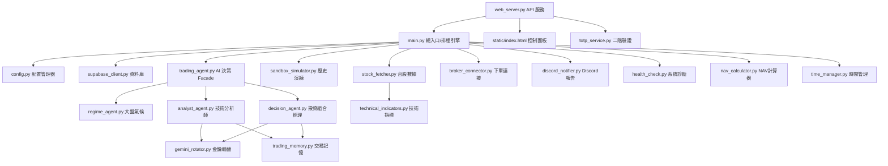

# AIAutoStocks - AI 台股自動量化交易排程引擎

[](https://www.python.org/)
[](https://supabase.com/)
[](https://ai.google.dev/)

`AIAutoStocks` 是一個基於 Large Language Model (LLM - Google Gemini API) 與 Supabase 的台股自動化量化交易與排程控制系統。系統設計採用多層級 AI 決策架構，結合「交易記憶與經驗管理器（Few-Shot Learning）」，能自動擷取台股歷史日 K 線與技術指標，生成具備詳細理據的交易決策（買入、賣出、觀望）。

系統支援**實時交易/模擬盤 (Live Trading)**、**永豐沙盒模擬交易 (Shioaji Simulation)**、**歷史數據沙盒回測演練 (Sandbox Simulation)**，並配備一個具備 TOTP 二階段驗證的安全**網頁控制台儀表板**，方便追蹤損益與控制交易流程。

---

## 🏗️ 系統架構與特色

本專案採用高度模組化、多層級 AI 代理與護欄防衛架構設計：


```mermaid
graph TD
    A[main.py 總入口/排程引擎] --> B[config.py 配置管理器]
    A --> C[supabase_client.py 資料庫]
    A --> D[stock_fetcher.py 台股數據]
    A --> E[sandbox_simulator.py 歷史演練]
    A --> F[trading_agent.py AI 決策 Facade]
    
    W[web_server.py API 服務] --> A
    W --> H1[static/index.html 控制面板]
    W --> T[totp_service.py 二階驗證]
    
    F --> F1[regime_agent.py 大盤氣候]
    F --> F2[analyst_agent.py 技術分析師]
    F --> F3[decision_agent.py 投資組合經理]
    
    F2 --> G[gemini_rotator.py 金鑰輪替]
    F2 --> M[trading_memory.py 交易記憶]
    F3 --> G
    F3 --> M
    
    A --> I[broker_connector.py 下單連接]
    A --> J[discord_notifier.py Discord報告]
    A --> H2[health_check.py 系統診斷]
    A --> N[nav_calculator.py NAV計算器]
    
    D --> TI[technical_indicators.py 技術指標]
    A --> TM[time_manager.py 時間管理]
```

### 🌟 核心特色

1. **多層級 AI 智能決策管線**：
   - **第一層：大盤氣候判定 (`regime_agent.py`)**：分析大盤加權指數 (TAIEX) 的走勢，判定當前氣候（如多頭、空頭、震盪），生成對應的風險限額乘數 (Risk Multiplier) 與交易姿態，防範大盤系統性風險。
   - **第二層：技術分析師評分 (`analyst_agent.py`)**：為每檔股票在「趨勢、動能、成交量、安全防守、大盤一致性」五個維度進行量化評分 (0 ~ 20 分，滿分 100 分) 並生成技術分析原因。
   - **第三層：投資組合配置經理 (`decision_agent.py`)**：橫向對比所有分析個股，做出最終的交易建議 (BUY / SELL / HOLD)，並配合 Python 端的「水箱分配演算法 (Water-Filling)」在單股限額與每日交易上限內動態分配買入資金與股數。
   - **協調門面與故障防衛 (`trading_agent.py`)**：整合分析與決策管線，並在系統處於故障狀態 (SYSTEM FAULT) 時主動阻斷交易，實施安全避險。
2. **Web UI 儀表板控制台 (`web_server.py` & `src/static/index.html`)**：
   - 視覺化顯示當前帳戶資產淨值 (NAV)、現金餘額、持股庫存與各部位帳面損益。
   - 即時編輯監控自選股清單、系統參數（如初始資金、風控限額比例、模擬/實盤模式）。
   - 提供系統執行日誌 (system_logs) 檢視與手動觸發/停止 AI 交易排程。
   - 支援手動平倉解鎖、手動庫存同步、以及手動解除全局系統故障鎖。
3. **二階段驗證安全登入 (TOTP, `totp_service.py`)**：
   - 網頁端提供 TOTP 安全防衛。若未指定環境變數 `TOTP_SECRET`，系統會基於解密主密鑰 (`MASTER_KEY`) 自動生成一組穩定的 Base32 金鑰。
   - 登入時會提示您掃描 QR Code 綁定 Authenticator App，大幅提升遠端部署與雲端容器運作的安全性。
4. **雙時區與虛擬時間軸調度 (`time_manager.py`)**：
   - 內建台灣時間 (Asia/Taipei) 與 UTC 的日期區間轉換。
   - 支援在歷史模擬回測時，無縫凍結真實時間、改為驅動虛擬沙盒日期，使回測結果的時間戳與資料庫一致。
5. **運行前自檢與下單安全預檢 (`health_check.py`)**：
   - 啟動前進行系統健康檢查 (Pre-flight Diagnostics)，驗證 Supabase、Gemini API、永豐證券 (實盤下) 連線是否順暢。
   - 下單前進行交易審查 (Pre-order Safety Audit)，嚴格比對台股漲跌幅限制 (±10%)、是否符合台股升降單位 (Tick Size)、以及是否超額。
6. **多 Gemini API 金鑰輪替與冷卻機制 (`gemini_rotator.py`)**：
   - 支援多組免費/付費的 Gemini API 金鑰自動輪替。當某金鑰觸發 429 限制（RPM/RPD）時，自動標記冷卻並切換至其他可用金鑰，確保決策不中斷。
7. **Few-Shot 交易記憶管理器 (`trading_memory.py`)**：
   - 自 Supabase 讀取過往平倉交易記錄，動態篩選出高收益的「成功交易」與虧損的「失敗交易」作為經驗背景注入 AI Prompt，供 AI 吸取歷史教訓。
8. **安全憑證解密管理器 (`credential_manager.py`)**：
   - 利用 AES-256-GCM 演算法將敏感憑證（Supabase Key、Discord Webhooks 網址、Gemini 多組 API Key、證券商 API Key 等）加密保存於 `credentials.enc`。
   - 執行時透過環境變數傳入主密鑰 `MASTER_KEY` 於記憶體中解密，確保敏感憑證不外洩。
9. **精美 Discord Webhook 報告 (`discord_notifier.py`)**：
   - 使用富文本 Embed 格式將每日報告發送至 Discord，包含當日交易盈虧、持股狀態與 AI 預測。

---

## 📁 檔案目錄結構

```text
AIAutoStocks/
├── src/
│   ├── agents/
│   │   ├── analyst_agent.py        # 技術分析師代理 (K線多維度評分與技術指標分析)
│   │   ├── decision_agent.py       # 投資組合配置經理代理 (水箱預算分配與風控護欄)
│   │   ├── regime_agent.py        # 大盤氣候診斷代理 (分析大盤走勢與風險限額乘數)
│   │   └── trading_agent.py       # 雙層 Agent 管線門面 (Facade) 與故障防守機制
│   ├── services/
│   │   ├── broker_connector.py    # 證券商下單連接器 (防呆、超限防護與模擬下單)
│   │   ├── credential_manager.py  # 安全憑證與金鑰管理器 (AES-GCM 解密)
│   │   ├── discord_notifier.py    # Discord 每日報告與警報發送器
│   │   ├── gemini_rotator.py      # Gemini API 金鑰輪替與冷卻重試
│   │   ├── health_check.py        # 運行前診斷與下單安全審查器
│   │   ├── nav_calculator.py      # 資產淨值 (NAV) 計算與動態限額快取
│   │   ├── sandbox_simulator.py   # 沙盒回測演練與歷史行情重播器
│   │   ├── stock_fetcher.py       # 台股與大盤 K 線與即時報價擷取器
│   │   ├── supabase_client.py     # Supabase 連線與資料庫 CRUD 封裝
│   │   ├── technical_indicators.py# 價格/成交量指標計算器 (SMA, EMA, RSI, MACD, DMI)
│   │   ├── totp_service.py        # TOTP 驗證與 Session Token 管理服務
│   │   └── trading_memory.py      # 交易得失與經驗檢索管理器
│   ├── static/
│   │   └── index.html             # Web Dashboard 控制台前端頁面
│   ├── config.py                  # 配置與環境變數驗證器
│   ├── main.py                    # 系統總入口/命令列排程引擎
│   ├── time_manager.py            # 時區與模擬/真實時間軸協調器
│   └── web_server.py              # FastAPI Web API 與手動交易背景執行服務
├── tests/                         # 單元測試 (pytest)
├── config.json                    # 本機外部配置檔 (不提交敏感金鑰)
├── config.example.json            # 外部配置檔範本
├── credentials.enc                # 加密後的安全憑證檔案 (可安全上傳 Git)
├── credentials.example.json       # 敏感憑證設定檔範本
├── encrypt_credentials.py         # 憑證加密與解密測試工具
├── import_history.py              # 台股歷史 K 線批次下載與導入器
├── fly.toml                       # Fly.io 容器部署配置
├── Dockerfile                     # 容器部署 Dockerfile
├── requirements.txt               # 專案依賴套件
├── main.py                        # 根目錄執行檔入口 (簡化 CLI 指令)
└── README.md                      # 專案說明文件
```

---

## 🛠️ 安裝與快速開始

### 1. 複製專案與安裝套件
請確保安裝了 **Python 3.10** 以上版本：
```bash
git clone https://github.com/your-repo/AIAutoStocks.git
cd AIAutoStocks
pip install -r requirements.txt
```

### 2. 配置系統設定檔 (`config.json`)
將根目錄下的 `config.example.json` 複製並命名為 `config.json`，然後填入您的系統與帳戶參數設定：
```json
{
  "GEMINI_MODEL": "gemini-1.5-flash",
  "MASTER_KEY": "your-secure-passphrase-to-decrypt-credentials-file",
  "TRADING_LIMIT_SINGLE_STOCK_PCT": 0.05,
  "TRADING_LIMIT_DAILY_TOTAL_PCT": 0.15,
  "INITIAL_CASH": 1000000.0,
  "PAPER_TRADING_MODE": "true",
  "TAIWAN_STOCK_TIMEZONE": "Asia/Taipei",
  "CREDENTIALS_FILE_PATH": "credentials.enc",
  "SANDBOX_START_DATE": "2026-05-01",
  "SANDBOX_END_DATE": "2026-06-08"
}
```
> [!IMPORTANT]
> - `config.json` 保留給無敏感資訊的安全防呆、時區與模擬起訖設定，敏感密鑰均抽離至加密憑證檔。
> - `MASTER_KEY` 為您的解密主密鑰，用於解密敏感憑證檔 (`credentials.enc`)，請務必設定複雜且安全的字串。

### 3. 配置安全憑證與加密檔案 (`credentials.enc`)
為了避免真實帳密（如 Supabase 密鑰、Discord Webhooks 網址、Gemini 多組 API Key、證券商 API Key 等）意外上傳至 Git，系統提供憑證加密機制：

1. **複製憑證範本**：
   ```bash
   cp credentials.example.json credentials.json
   ```
2. **填寫真實憑證**：
   開啟 `credentials.json` 填入您的真實金鑰設定（包含 `geminiApiKeys` 陣列、`supabase`、`discord` 及 `brokerCredentials` 資訊）。
3. **執行加密工具**：
   ```bash
   python encrypt_credentials.py
   ```
   加密完成後會生成安全憑證檔 `credentials.enc`。腳本會詢問是否刪除明文 `credentials.json`，請確認刪除。

#### 🔑 證券商電子憑證 (`.pfx`) 的處理與自動上傳
永豐金證券下單 (Shioaji) 在實盤交易時，必須使用電子憑證檔案（例如 `Sinopac.pfx`）。系統已針對此處理進行了安全與部署上的優化：

1. **本機配置與加密**：
   * 請向永豐金證券申請電子憑證，下載後命名為 `Sinopac.pfx` 並直接放置於**專案根目錄**下。
   * 專案的 `.gitignore` 已設定過濾 `*.pfx`，因此該憑證**絕對不會**被意外提交到 Git 儲存庫。
   * 在 `credentials.json` 中的 `"brokerCredentials"` 內，將 `"certificatePath"` 設定為 `"Sinopac.pfx"`（即相對路徑），並填寫正確的憑證密碼等資訊。
   * 執行 `python encrypt_credentials.py`，將密碼等敏感設定加密存入 `credentials.enc`。

2. **Docker / 雲端部署 (如 Fly.io) 自動打包**：
   * 專案的 `Dockerfile` 中已配置了條件式複製指令：`COPY Sinopac.pf[x] ./`。
   * 當您在本地執行 `fly deploy`（或 `docker build`）時，若您的根目錄下存在 `Sinopac.pfx`，Docker 建置流程會**自動將該憑證打包進容器的 `/app` 工作目錄**中。
   * 系統在容器內運行時，將會從解密後的設定檔中讀取到 `"certificatePath": "Sinopac.pfx"`，並直接在容器根目錄載入。
   * **無需手動透過 SSH/SFTP 上傳憑證至雲端主機**。只要在部署前確保本機根目錄有 `Sinopac.pfx`，部署指令會一併處理。


---

## 🚀 執行模式與指令說明

### 1. 實時交易/模擬盤模式 (Live Trading Mode)
實時獲取自選監控股票的最新歷史 K 線並儲存至 Supabase，接著呼叫 AI 決策代理生成交易訊號，並執行下單。內建跳過週末非交易日邏輯，適合設定為每日 Cron 排程任務。

> [!NOTE]
> **自動定時排程機制**：
> - **執行時段**：系統在背景運行定時排程引擎（永動機），預設僅在每日 **15:00 - 17:00**（台灣時間，排除週末）自動觸發交易任務。
> - **預約單模式**：此時段證交所已發布今日完整的日 K 歷史數據，AI 將基於此數據進行分析判定，並向券商送出**次日交易預約單**。此舉可避免盤後零股交易（13:40 - 14:30）撮合率極低的流動性問題，排隊至隔日 9:00 開盤時段直接撮合，成交率極高。
> - **去重週期判定**：系統以每日台灣時間 **13:30** 作為去重的週期基準點（即每日 13:30 之後的執行均計為當日已分析，防止重複執行與下單）。

```bash
# 預設模式（以台積電 2330、聯發科 2454 為例）
python main.py --mode live --stocks 2330,2454
```

### 2. 沙盒歷史回測模擬模式 (Sandbox Mode)
根據您指定的起訖時間，重播 Supabase 中已儲存的歷史日 K 線資料，以測試 AI 的交易決策表現與收益率。所有訂單及持股變動均會寫入帶有 `is_paper = true` 的資料表中，且不會觸發真實下單 API。
```bash
# 執行指定時間區間的歷史數據沙盒演練
python main.py --mode sandbox --stocks 2330,2454 --start-date 2026-05-01 --end-date 2026-06-08
```
> [!TIP]
> 進行沙盒回測前，請確保 Supabase 中已存有該時段的 K 線數據（可利用 `import_history.py` 下載）。

### 3. 一鍵下車/清空持股模式 (Liquidate Mode)
立即獲取當前帳戶模式下的所有持股倉位，自動獲取盤中即時報價對每檔持股送出 `SELL` 委託進行平倉，並同步關閉自動交易開關 (`AUTO_TRADING_ACTIVE = false`)，實現一鍵防禦性平倉。
```bash
python main.py --mode liquidate
```

### 4. 永豐金證券 API 沙盒模擬交易 (永豐沙盒)
若要在真實排程流程中測試與證券商 API 的連接，而不用實彈下單，請在 `credentials.json` 的 `brokerCredentials` 區塊加入 `"simulation": true`，系統啟動時會連線至永豐模擬交易主機，且報告與安全警報會自動標記 `永豐沙盒` 發送至 Discord。

### 5. 啟動 Web UI 儀表板控制台 (FastAPI Dashboard)
本系統附帶一個基於 FastAPI 實作的 Web 控制面板，方便視覺化追蹤庫存損益、手動調整自選股與動態參數、檢視日誌、手動執行排程與進行故障解鎖。
```bash
python src/web_server.py
```
啟動後在瀏覽器開啟 `http://localhost:8080` (預設為 8080 埠，可透過環境變數 `PORT` 修改)。

#### 🔒 二階段登入驗證 (TOTP)
- 登入網頁需要輸入 6 位數 TOTP 驗證碼。
- 若未在配置中指定 `TOTP_SECRET`，系統會基於您的 `MASTER_KEY` 自動生成一組穩定的 Base32 金鑰。
- 在網頁登入介面，首次將提示您使用 Google Authenticator 等應用程式掃描網頁上的 QR Code 綁定。

### 6. 台股歷史數據導入
若要進行 sandbox 回測演練，資料表必須存有對應時間段的 K 線數據。可利用此批次導入工具：
```bash
# 下載指定期間的個股數據與大盤加權指數 (TAIEX) 的歷史日 K 線並寫入 Supabase
python import_history.py --stocks top5 --start-date 2026-05-01 --end-date 2026-06-08
```

---

## 🗄️ Supabase 資料庫建置 (SQL Schema)

請在您的 Supabase 專案中，前往 **SQL Editor** 執行專案根目錄下 [supabase_schema.sql](file:///Users/jpopaholic/Documents/AIAutoStocks/supabase_schema.sql) 的全部內容，以建立以下 8 張資料表、加速查詢索引與初始設定值：

1. `watchlist` — 自選監控股票清單（支援 Upsert）
2. `holdings` — 目前持股明細（支援 Paper Trading / 實盤劃分）
3. `trade_orders` — 交易訂單歷史紀錄（包含委託狀態 `status`、實際成交價 `execution_price` 與券商委託單號 `order_id`）
4. `stock_klines` — 股票歷史日 K 線數據（包含自定義技術指標欄位）
5. `system_logs` — 系統運行日誌（提供網頁端即時查詢，自動 TTL 清理 7 天）
6. `system_config` — 動態系統配置參數（提供網頁前端進行動態覆蓋）
7. `gemini_keys_state` — Gemini API 金鑰輪替與冷卻狀態
8. `daily_analysis` — 每日 AI 分析執行紀錄（記錄大盤氣候、交易姿態與風險乘數）

<details>
<summary>點擊展開完整的 SQL 建表與初始化語法</summary>

```sql
-- =============================================================================
-- AIAutoStocks — Supabase 完整資料庫 Schema
-- 請在 Supabase 後台 → SQL Editor 中執行此檔案
-- =============================================================================

-- -----------------------------------------------------------------------------
-- 1. watchlist — 自選監控股票清單
-- -----------------------------------------------------------------------------
CREATE TABLE IF NOT EXISTS watchlist (
    id          BIGSERIAL PRIMARY KEY,
    stock_code  TEXT NOT NULL UNIQUE,   -- 4 碼股票代號，唯一鍵（支援 upsert）
    created_at  TIMESTAMPTZ NOT NULL DEFAULT NOW()
);

-- 加速查詢索引
CREATE INDEX IF NOT EXISTS idx_watchlist_stock_code ON watchlist (stock_code);

-- 啟用 Row Level Security（建議，但 service role key 可繞過）
ALTER TABLE watchlist ENABLE ROW LEVEL SECURITY;


-- -----------------------------------------------------------------------------
-- 2. holdings — 目前持股明細
-- -----------------------------------------------------------------------------
CREATE TABLE IF NOT EXISTS holdings (
    id            BIGSERIAL PRIMARY KEY,
    stock_code    TEXT NOT NULL,
    quantity      NUMERIC(18, 4) NOT NULL DEFAULT 0,
    average_price NUMERIC(18, 4) NOT NULL DEFAULT 0,
    is_paper      BOOLEAN NOT NULL DEFAULT TRUE,   -- TRUE=沙盒模擬, FALSE=實盤
    updated_at    TIMESTAMPTZ NOT NULL DEFAULT NOW(),
    UNIQUE (stock_code, is_paper)                  -- 支援 upsert on_conflict
);

CREATE INDEX IF NOT EXISTS idx_holdings_stock_code ON holdings (stock_code);
CREATE INDEX IF NOT EXISTS idx_holdings_is_paper   ON holdings (is_paper);

ALTER TABLE holdings ENABLE ROW LEVEL SECURITY;


-- -----------------------------------------------------------------------------
-- 3. trade_orders — 交易訂單歷史紀錄
-- -----------------------------------------------------------------------------
CREATE TABLE IF NOT EXISTS trade_orders (
    id            BIGSERIAL PRIMARY KEY,
    stock_code    TEXT NOT NULL,
    action        TEXT NOT NULL CHECK (action IN ('BUY', 'SELL')),
    price         NUMERIC(18, 4) NOT NULL,
    quantity      NUMERIC(18, 4) NOT NULL,
    fee           NUMERIC(18, 4) NOT NULL DEFAULT 0,
    total_amount  NUMERIC(18, 4) NOT NULL,
    realized_pnl  NUMERIC(18, 4) NOT NULL DEFAULT 0,
    is_paper      BOOLEAN NOT NULL DEFAULT TRUE,
    executed_at   TIMESTAMPTZ NOT NULL DEFAULT NOW(),
    execution_price NUMERIC(18, 4),                     -- 實際成交價
    status        TEXT NOT NULL DEFAULT 'PENDING',    -- 訂單狀態: PENDING, FILLED, CANCELLED, FAILED
    order_id      TEXT                                -- 券商委託單號
);

CREATE INDEX IF NOT EXISTS idx_trade_orders_stock_code   ON trade_orders (stock_code);
CREATE INDEX IF NOT EXISTS idx_trade_orders_executed_at  ON trade_orders (executed_at DESC);
CREATE INDEX IF NOT EXISTS idx_trade_orders_is_paper     ON trade_orders (is_paper);

ALTER TABLE trade_orders ENABLE ROW LEVEL SECURITY;


-- -----------------------------------------------------------------------------
-- 4. stock_klines — 股票歷史 K 線數據
-- -----------------------------------------------------------------------------
CREATE TABLE IF NOT EXISTS stock_klines (
    id          BIGSERIAL PRIMARY KEY,
    stock_code  TEXT NOT NULL,
    date        DATE NOT NULL,
    open        NUMERIC(18, 4),
    high        NUMERIC(18, 4),
    low         NUMERIC(18, 4),
    close       NUMERIC(18, 4),
    volume      BIGINT,
    updated_at  TIMESTAMPTZ NOT NULL DEFAULT NOW(),
    UNIQUE (stock_code, date)                     -- 支援 upsert on_conflict
);

CREATE INDEX IF NOT EXISTS idx_stock_klines_stock_date ON stock_klines (stock_code, date DESC);

ALTER TABLE stock_klines ENABLE ROW LEVEL SECURITY;


-- -----------------------------------------------------------------------------
-- 5. system_logs — 系統執行日誌（自動 TTL 清理 7 天）
-- -----------------------------------------------------------------------------
CREATE TABLE IF NOT EXISTS system_logs (
    id         BIGSERIAL PRIMARY KEY,
    level      TEXT NOT NULL DEFAULT 'INFO',   -- INFO / WARN / ERROR
    message    TEXT NOT NULL,
    details    JSONB,
    is_paper   BOOLEAN NOT NULL DEFAULT TRUE,  -- TRUE=沙盒模擬, FALSE=實盤
    created_at TIMESTAMPTZ NOT NULL DEFAULT NOW()
);

CREATE INDEX IF NOT EXISTS idx_system_logs_created_at ON system_logs (created_at DESC);
CREATE INDEX IF NOT EXISTS idx_system_logs_level      ON system_logs (level);
CREATE INDEX IF NOT EXISTS idx_system_logs_is_paper   ON system_logs (is_paper);

ALTER TABLE system_logs ENABLE ROW LEVEL SECURITY;


-- -----------------------------------------------------------------------------
-- 6. system_config — 動態系統配置參數（key-value 形式）
-- -----------------------------------------------------------------------------
CREATE TABLE IF NOT EXISTS system_config (
    id         BIGSERIAL PRIMARY KEY,
    key        TEXT NOT NULL UNIQUE,
    value      TEXT NOT NULL,
    updated_at TIMESTAMPTZ NOT NULL DEFAULT NOW()
);

CREATE INDEX IF NOT EXISTS idx_system_config_key ON system_config (key);

ALTER TABLE system_config ENABLE ROW LEVEL SECURITY;

-- 預設動態配置初始值（可從前端覆蓋）
INSERT INTO system_config (key, value) VALUES
    ('PAPER_TRADING_MODE',           'true'),
    ('INITIAL_CASH',                 '1000000'),
    ('TRADING_LIMIT_SINGLE_STOCK_PCT', '0.1'),
    ('TRADING_LIMIT_DAILY_TOTAL_PCT',  '0.3'),
    ('SANDBOX_START_DATE',           '2026-05-01'),
    ('SANDBOX_END_DATE',             '2026-06-09'),
    ('GEMINI_MODEL',                 'gemini-1.5-flash'),
    ('AUTO_TRADING_ACTIVE',          'true'),
    ('TAIWAN_STOCK_TIMEZONE',        'Asia/Taipei')
ON CONFLICT (key) DO NOTHING;


-- -----------------------------------------------------------------------------
-- 7. gemini_keys_state — Gemini API 金鑰輪替狀態
-- -----------------------------------------------------------------------------
CREATE TABLE IF NOT EXISTS gemini_keys_state (
    id           BIGSERIAL PRIMARY KEY,
    key_hash     TEXT NOT NULL UNIQUE,   -- API key 的 SHA256 雜湊（不儲存明文）
    use_count    INTEGER NOT NULL DEFAULT 0,
    rpm_limit    INTEGER NOT NULL DEFAULT 15,
    rpd_limit    INTEGER NOT NULL DEFAULT 1500,
    last_used_at TIMESTAMPTZ,
    cooled_until TIMESTAMPTZ
);

CREATE INDEX IF NOT EXISTS idx_gemini_keys_key_hash ON gemini_keys_state (key_hash);

ALTER TABLE gemini_keys_state ENABLE ROW LEVEL SECURITY;


-- -----------------------------------------------------------------------------
-- 8. daily_analysis — 每日 AI 分析執行紀錄
-- -----------------------------------------------------------------------------
CREATE TABLE IF NOT EXISTS daily_analysis (
    id              BIGSERIAL PRIMARY KEY,
    analysis_date   DATE NOT NULL,                   -- 台灣當日日期 (e.g. 2026-07-08)
    is_paper        BOOLEAN NOT NULL DEFAULT TRUE,   -- TRUE=沙盒, FALSE=實盤
    trigger_type    TEXT NOT NULL DEFAULT 'auto',    -- 'auto' 或 'manual'
    regime          TEXT,                            -- 大盤氣候狀態 (e.g. 'BULLISH_TREND')
    posture         TEXT,                            -- 交易姿態 (e.g. 'MODERATE')
    risk_multiplier NUMERIC(6, 2),                   -- 風險乘數
    created_at      TIMESTAMPTZ NOT NULL DEFAULT NOW()
);

CREATE INDEX IF NOT EXISTS idx_daily_analysis_date    ON daily_analysis (analysis_date DESC);
CREATE INDEX IF NOT EXISTS idx_daily_analysis_paper   ON daily_analysis (is_paper);
CREATE INDEX IF NOT EXISTS idx_daily_analysis_trigger ON daily_analysis (trigger_type);

ALTER TABLE daily_analysis ENABLE ROW LEVEL SECURITY;
```
</details>

---

## 🧪 單元測試
專案使用 `pytest` 進行測試，執行以下指令以執行系統測試：
```bash
pytest
```

---

## 🐳 Docker 部署 (以 Fly.io 為例)
本專案已備妥 `Dockerfile` 並預設設定台灣時區 (Asia/Taipei)。

要在 **Fly.io** 上部署：
1. 初始化並配置 Fly.io app：
   ```bash
   fly launch
   ```
2. 將包含解密主密鑰 `MASTER_KEY` 的 `config.json` 內容作為 Secret 環境變數傳入：
   ```bash
   fly secrets set CONFIG_JSON="$(cat config.json)"
   ```
   > [!IMPORTANT]
   > - `credentials.enc` 已隨程式碼封裝在容器中，執行時將自動透過 Secrets 傳入的 `MASTER_KEY` 解密並合併連線憑證。
3. 在 Fly.io 上設定 Cron Job 定時排程以進行每日自動收盤量化分析交易。
