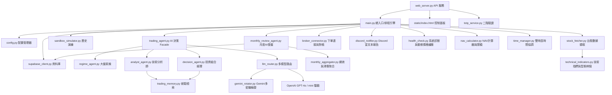

# AIAutoStocks - AI 台股自動量化交易排程引擎

[](https://www.python.org/)
[](https://supabase.com/)
[](https://ai.google.dev/)
[](https://fly.io/)

> [!CAUTION]
> ### ⚠️ 免責聲明 (Disclaimer)
> 
> 1. **技術研究與學習交流**：本專案（`AIAutoStocks`）僅供**技術研究、程式開發、量化交易實驗與學習交流用途**。專案**不提供代客操作、不管理使用者資金、不代替使用者做出投資決策**。
> 2. **模型輸出結果定位**：專案內產出之 AI 分析、評分與 **BUY / SELL / HOLD** 等訊號僅代表模型輸出結果，**均不構成任何形式之投資諮詢、財務建議或買賣推薦**。
> 3. **獨立部署與實盤責任**：本專案採用自主部署架構（Own Supabase & Broker API）。**啟用 Live Trading 前，請確認交易帳戶、API 設定與風險控制措施。**
> 4. **完整條款說明**：有關違約交割責任、槓桿風險與法律免責聲明之完整細節，請參閱 [DISCLAIMER.md](DISCLAIMER.md)。

`AIAutoStocks` 是一個基於 Large Language Model（支援 **Google Gemini** 與 **OpenAI GPT-4o** 雙引擎智慧路由）與 **Supabase** 的台股自動化量化交易與排程控制系統。系統採用多層級 AI 決策架構，深度整合「交易記憶與經驗管理器（Few-Shot Learning）」與「月度戰術 Skills 自主演化機制」，自動獲取台股歷史日 K 線與技術指標，生成兼具深入理據與硬核風控護欄的交易決策。

系統支援**實盤交易 / 模擬盤交易 (Live Trading / Paper Trading)**、**永豐沙盒模擬交易 (Shioaji Simulation)**、**歷史數據沙盒回測演練 (Sandbox Simulation)**、**雙向動態價格緩衝 (Price Slippage Buffer & Dynamic Liquidation)**、**水箱式動態預算分配演算法 (Water-Filling)**，並配備具備 TOTP 二階段驗證與豐富控制功能的**網頁控制台儀表板 (FastAPI Web Dashboard)** 與**精美 Discord Webhook 即時通報系統**，提供高可用性、高安全性的量化自動交易體驗。

---

## 🏗️ 系統架構與核心特色

本專案採用模組化解耦、多層級 AI 代理與多道硬核護欄防衛體系：


```mermaid
graph TD
    A[main.py 總入口/排程引擎] --> B[config.py 配置管理器]
    A --> C[supabase_client.py 資料庫]
    A --> D[stock_fetcher.py 台股數據擷取]
    A --> E[sandbox_simulator.py 歷史演練]
    A --> F[trading_agent.py AI 決策 Facade]
    
    W[web_server.py API 服務] --> A
    W --> H1[static/index.html 控制面板]
    W --> T[totp_service.py 二階驗證]
    
    F --> F1[regime_agent.py 大盤氣候]
    F --> F2[analyst_agent.py 技術分析師]
    F --> F3[decision_agent.py 投資組合經理]
    
    F --> LR[llm_router.py 多模型路由]
    LR --> G[gemini_rotator.py Gemini多密鑰輪替]
    LR --> OA[OpenAI GPT-4o / mini 驅動]
    
    F2 --> M[trading_memory.py 經驗檢索]
    F3 --> M
    
    A --> MR[monthly_review_agent.py 月度AI復盤]
    MR --> MA[monthly_aggregator.py 績效與滑價聚合]
    MR --> C
    
    A --> I[broker_connector.py 下單連接與對帳]
    A --> J[discord_notifier.py Discord富文本報告]
    A --> H2[health_check.py 系統診斷與動態價格緩衝]
    A --> N[nav_calculator.py NAV計算器與限額]
    
    D --> TI[technical_indicators.py 技術指標與型態辨識]
    A --> TM[time_manager.py 雙時區時間協調]
```

### 🌟 核心特色

1. **🤖 多 LLM 模型提供者與智慧路由引擎 (`llm_router.py`)**：
   - 原生支援 **Google Gemini**（Gemini 2.0 Flash / 3.6 Flash）與 **OpenAI**（GPT-4o / GPT-4o-mini）雙強驅動。
   - 可透過系統配置 `AI_PROVIDER` 設定為 `"auto"`（自動優先偵測可用金鑰）、`"gemini"` 或 `"openai"`。
   - 內建統一 Structured Outputs（Pydantic / JSON Schema）解析、模型 API 故障自動降級與備援切換機制。

2. **🌦️ 6 階市場氣候與 5 階交易姿態動態風控 (`regime_agent.py`)**：
   - **六階市場狀態 (Regime)**：`STRONG_BULL` (強勢多頭), `REBOUND_BULL` (驚驚漲/震盪偏多), `CALM_RANGE` (低波動橫盤), `VOLATILE_RANGE` (高波動震盪), `CORRECTION_BEAR` (震盪修正), `PANIC_BEAR` (恐慌空頭)。
   - **五階交易姿態 (Posture)**：`STRONG_ATTACK` (強攻攻勢), `MODERATE_ATTACK` (穩健進攻), `CHOPPY_TACTICAL` (震盪靈活), `DEFENSIVE_ACCUMULATION` (防禦承接), `STRICT_DEFENSE` (極度保守)。
   - **動態水位連動**：動態對齊建議現金儲備水位（5% ~ 90%）、允許之買進行為模式（如突破型、拉回型、防禦價值型、零股防禦建倉）與動態風險限額乘數（0.15 ~ 1.0），確保空頭時主動提高現金避險。

3. **🧠 多層級 AI 智能決策管線與水箱演算法**：
   - **第一層：大盤氣候診斷 (`regime_agent.py`)**：宏觀診斷台股加權指數 (TAIEX) 的趨勢與型態，判定當前氣候與姿態。
   - **第二層：技術分析師評分 (`analyst_agent.py`)**：針對個股在「趨勢、動能、成交量、安全防守、大盤一致性」五大維度量化打分（0 ~ 20 分，滿分 100 分），並給出專業量化理由。
   - **第三層：投資組合配置經理 (`decision_agent.py`)**：全盤橫向對比個股分數與市場狀態，生成 BUY / SELL / HOLD 決策，並透過 Python 端的「**水箱式預算分配演算法 (Water-Filling)**」在單股限額與每日交易上限內動態分配買入金額與股數。
   - **協調門面與故障防衛 (`trading_agent.py`)**：串接分析決策管線；當檢測到系統故障狀態 (SYSTEM FAULT) 時主動熔斷交易。

4. **⚡ 雙向動態價格緩衝機制 (Price Slippage Buffer & Dynamic Liquidation)**：
   - **買進溢價追價 (BUY Premium Buffer)**：依據 AI 評定總分（$\ge 85$分 $+1.5\%$, $70\sim 84$分 $+1.0\%$, $<70$分 $+0.5\%$）自動計算高於參考價的委託限價，並自動對齊台股升降單位 (Tick Size)，徹底消除跳空開高買不到 (Gap-Up miss) 的痛點；同時買進股數精確以最高可能成交價反推，保證 100% 不超支。
   - **賣出/平倉折價讓價 (SELL Discount Buffer)**：風控賣出（$-1.0\%\sim -1.5\%$）與一鍵平倉（$-1.5\%$）自動計算低於基準價之委託下限，利用證交所「最佳買價優先撮合」機制取得最高成交順位，防止跌勢中因掛價過高而無法成交。

5. **🛡️ 嚴密 Python 硬核護欄防衛體系 (Multi-Layered Safeguards)**：
   - **同日對沖防護 (Anti-Churning Safeguard)**：同日已買進之股票當日禁止反向賣出；同日已賣出之股票當日禁止反向買回，避免高頻短沖與手續費摩擦。
   - **虧損平倉冷卻期 (Loss Cooldown Guard)**：當日內若賣出某檔股票且為虧損平倉 (`realized_pnl < 0`)，自動將該股列入冷卻清單 (`cooldown_stocks`)，當日禁止再次建倉。
   - **智慧平倉與等候佇列重寫 (Pending Liquidation Override)**：已進入平倉佇列之個股，即使 LLM 誤判回傳 `BUY` 訊號，系統將強制校正為 `HOLD` 並清零股數，確保部位順利出場。
   - **脈絡上下文護欄 (Context Guard)**：無持股庫存時強制過濾 LLM 輸出的「減碼/獲利了結」等幻覺技能；總分達標時強制過濾「未達門檻」幻覺引用。
   - **執行緒與排程鎖定防護 (Thread & Scheduler Safeguards)**：當交易排程執行中，API 端強制鎖定禁止切換交易模式（實盤/模擬盤）；背景工作執行緒在每次迭代時嚴格比對模式一致性，若偵測到外部異常篡改立即安全退出。

6. **🔍 K 線轉折型態自動辨識與機率鎖 (`analyst_agent.py`)**：
   - 自動計算 **V 型反彈機率 (`v_reversal_prob`)** 與 **A 頂誘多預警機率 (`a_top_prob`)**。
   - 若型態機率小於 50%，Python 護欄會強效過濾 LLM 輸出的 V 轉 / A 頂戰術引用，杜絕模型產生形態幻覺。

7. **📊 券商真實委託對帳、未成交與滑價統計計算 (`monthly_aggregator.py` & `broker_connector.py`)**：
   - 支援將資料庫 PENDING 狀態之訂單與永豐金 Shioaji 券商端即時委託狀態精準對帳 (`sync_broker_orders`)。
   - 自動追蹤並記錄未成交單（包含過濾攔截與券商端取消），並統計實際成交價與委託價的偏差率，計算出**平均滑價率 (Mean Slippage Ratio)** 與**標準差 (Std Deviation)**。

8. **🔢 數值 Overflow 與巨量字串防衛 (`config.py`)**：
   - 內建 `safe_int()` 與 `safe_float()` 防護機制，防範 LLM 幻覺數字（如 4000+ 位數字）、`NaN`、`Inf` 與 `OverflowError`。
   - 自動解開 Python 3.11+ `sys.set_int_max_str_digits(0)` 上限，保障系統 7x24 高可用不崩潰。

9. **⏰ 交易排程時間視窗防護與休市/颱風假自檢 (`main.py`)**：
   - **時間視窗限制**：自動交易排程嚴格限制於台灣時間每日 **15:00 - 18:00** 執行，其餘時間自動阻斷。
   - **國定假日與颱風假自檢**：排程啟動時自動擷取台積電 (2330) 之即時行情與最新日 K 日期，若查無當日交易數據則判定為休市或天災停市，主動跳過排程。
   - **自動維護與舊資料修剪**：每日自動清理 7 天前之系統日誌 (`system_logs`) 與 30 天前之每日分析記錄 (`daily_analysis`)。
   - **手動重新分析重置**：透過 Web 控制台手動重跑時，系統自動同步券商並取消今日未成交委託，重置當日狀態以乾淨重新分析。

10. **Web UI 儀表板控制台 (`web_server.py` & `src/static/index.html`)**：
    - 即時視覺化展示帳戶資產淨值 (NAV)、現金餘額、持股庫存與各部位帳面損益。
    - 即時編輯與切換自選股清單、系統參數（如初始資金、風控限額比例、AI_PROVIDER 模型引擎切換、模擬/實盤模式）。
    - 提供系統運行日誌 (`system_logs`) 檢視、手動觸發/停止交易排程、一鍵下車平倉、手動對帳、故障鎖解除與 Discord 測試通知按鈕。
    - 預設綁定 `0.0.0.0:8080`，輕量化記憶體佔用（僅需 256MB），無縫相容 Fly.io 雲端容器部署。

11. **二階段驗證安全登入 (TOTP, `totp_service.py`)**：
    - 控制台支援 TOTP 二階驗證。若未指定環境變數 `TOTP_SECRET`，系統會基於解密主密鑰 (`MASTER_KEY`) 自動生成一組穩定的 Base32 金鑰。
    - 登入介面提示掃描 QR Code 綁定 Authenticator App，大幅強化遠端與雲端部署安全性。

12. **雙時區與虛擬時間軸調度 (`time_manager.py`)**：
    - 內建台灣時間 (Asia/Taipei) 與 UTC 的無縫轉換。
    - 支援歷史沙盒回測時凍結真實時間、改為驅動虛擬沙盒日期，使回測結果時間戳與資料庫一致。

13. **運行前自檢與下單安全預檢 (`health_check.py`)**：
    - 啟動前進行系統健康檢查 (Pre-flight Diagnostics)，驗證 Supabase、LLM API、永豐證券 (實盤下) 連線是否順暢。
    - 下單前進行交易審查 (Pre-order Safety Audit)，嚴格比對台股漲跌幅限制 (±10%)、是否符合台股升降單位 (Tick Size)、以及是否超額。

14. **多 Gemini API 金鑰輪替與冷卻機制 (`gemini_rotator.py`)**：
    - 支援多組 Gemini API 金鑰自動輪替。當某金鑰觸發 429 限制（RPM/RPD）時，自動標記冷卻並切換至其他可用金鑰，確保分析決策不中斷。

15. **Few-Shot 交易記憶管理器 (`trading_memory.py`)**：
    - 自 Supabase 讀取過往平倉交易記錄，動態篩選出高收益的「成功交易」與虧損的「失敗交易」作為經驗背景注入 Prompt，促使 AI 吸取歷史教訓。

16. **安全憑證解密管理器 (`credential_manager.py`)**：
    - 利用 AES-256-GCM 演算法將敏感憑證（Supabase Key、Discord Webhooks 網址、Gemini 多組 API Key、OpenAI API Key、證券商 API Key 等）加密保存於 `credentials.enc`。
    - 執行時透過環境變數傳入主密鑰 `MASTER_KEY` 於記憶體中解密，確保敏感憑證不進原始碼版本控制。

17. **精美 Discord Webhook 報告系統 (`discord_notifier.py`)**：
    - 每日報告依據分析師評分進行**由高至低降序排列**，並針對當前庫存個股採用**全行底線 (Underline) 顯著標註**，便於快速盤點持股與決策重點。
    - 支援分流通知管道：沙盒交易 (`webhookSandbox`)、實盤交易 (`webhookLive`)、月度復盤 (`webhookMonthlyReview`)、季度復盤 (`webhookQuarterlyReview`)、年度復盤 (`webhookYearlyReview`)。
    - 控制台提供專屬 Discord 測試發送按鈕，便於驗證通知連線狀態。

18. **月度與長週期 AI 復盤演化系統 (`monthly_review_agent.py` & `monthly_aggregator.py`)**：
    - 每月或週末自動/手動執行雙層 AI 復盤（Layer 1: 技術指標與打分診斷、Layer 2: 投資組合與倉位控制診斷）。
    - 聚合當月交易實績、滑價率、勝率、上下行預期，生成結構化 JSON Skills 並存入 Supabase `monthly_skills` 資料表。
    - 次月交易自動載入最新演化出的 Skills 規範，實現 AI 交易策略的自主進化與經驗傳承。
    - **週期跨度規範**：依據統一標準，季度與年度檢討統一以週六復盤日為基準跨度（季度涵蓋 3 個月度復盤日跨度 / 年度涵蓋 12 個月度復盤日跨度），確保紀錄無縫銜接。

---

## 📁 檔案目錄結構

```text
AIAutoStocks/
├── src/
│   ├── agents/
│   │   ├── analyst_agent.py        # 技術分析師代理 (K線多維度評分、V轉/A頂型態辨識與指標分析)
│   │   ├── decision_agent.py       # 投資組合配置經理代理 (水箱預算分配、追價/讓價、同日防沖與風控護欄)
│   │   ├── monthly_review_agent.py # 月度 AI 復盤與 Skills 自我演化代理 (雙層復盤診斷)
│   │   ├── regime_agent.py         # 大盤氣候診斷代理 (6階Regime與5階Posture動態姿態判定)
│   │   └── trading_agent.py        # 雙層 Agent 管線門面 (Facade) 與故障鎖避險機制
│   ├── services/
│   │   ├── broker_connector.py     # 證券商下單連接器 (防呆、超限防護、Tick對齊、對帳同步與模擬下單)
│   │   ├── credential_manager.py   # 安全憑證與金鑰管理器 (AES-GCM 記憶體解密)
│   │   ├── discord_notifier.py     # Discord 每日報告、降序排列、持股下劃線與分流警報發送器
│   │   ├── gemini_rotator.py       # Gemini 多組 API 金鑰輪替與冷卻重試
│   │   ├── health_check.py         # 運行前診斷、價格緩衝計算與下單安全審查器
│   │   ├── llm_router.py           # 多 LLM 提供者路由引擎 (Gemini & OpenAI 雙驅動)
│   │   ├── monthly_aggregator.py   # 月度交易數據、滑價率、上下行預期與績效指標聚合計算器
│   │   ├── nav_calculator.py       # 資產淨值 (NAV) 計算與動態限額快取
│   │   ├── sandbox_simulator.py    # 沙盒回測演練與歷史行情重播器
│   │   ├── stock_fetcher.py        # 台股與大盤 K 線與即時報價擷取器 (含休市/颱風假自檢)
│   │   ├── supabase_client.py      # Supabase 連線與資料庫 CRUD / TTL 日誌清理封裝
│   │   ├── technical_indicators.py # 價格/成交量指標計算器 (SMA, EMA, RSI, MACD, DMI, ADX)
│   │   ├── totp_service.py         # TOTP 驗證與 Session Token 管理服務
│   │   └── trading_memory.py       # 交易得失與 Few-Shot 經驗檢索管理器
│   ├── scratch/                    # 維護、診斷與測試腳本目錄
│   │   ├── tests/                  # 完整 pytest 單元測試套件 (65+ passed)
│   │   │   ├── test_buy_sell_price_buffer.py              # 雙向溢價/折價緩衝測試
│   │   │   ├── test_discord_notifier.py                   # Discord 報告排版與持股底線標註測試
│   │   │   ├── test_hybrid_liquidation.py                # 智慧平倉與強退護欄測試
│   │   │   ├── test_llm_router.py                         # LLM 路由引擎測試
│   │   │   ├── test_monthly_review.py                     # 月度復盤與演化測試
│   │   │   ├── test_numeric_overflow_safeguards.py        # 數值溢位防禦測試
│   │   │   ├── test_place_order.py                        # 券商下單防護測試
│   │   │   ├── test_realtime_quote.py                     # 即時報價連線測試
│   │   │   ├── test_regime_agent.py                       # 大盤氣候與姿態判定測試
│   │   │   ├── test_risk_limit_alignment.py              # 風險限額乘數與預算對齊測試
│   │   │   ├── test_scheduler_safeguards.py               # 排程執行緒防護與模式鎖定測試
│   │   │   ├── test_shioaji_login.py                      # 券商登入測試
│   │   │   ├── test_sync_broker_orders.py                 # 券商委託狀態同步與對帳測試
│   │   │   ├── test_technical_indicators.py               # 技術指標計算測試
│   │   │   ├── test_tick_size.py                          # 台股升降單位 (Tick Size) 測試
│   │   │   └── test_water_filling_and_unfilled_logging.py # 水箱預算分配與未成交紀錄測試
│   │   ├── check_logs.py           # 系統運行日誌快速查詢工具
│   │   ├── check_orders.py         # 訂單委託狀態與歷史明細檢查工具
│   │   ├── check_today_status.py   # 今日盤後執行狀態快速診斷工具
│   │   ├── cleanup_duplicates.py   # 資料庫重複資料與 K 線清理工具
│   │   └── import_scores.py        # 歷史 AI 個股評分明細大量導入器
│   ├── static/
│   │   └── index.html              # Web Dashboard 控制台前端頁面 (支援 TOTP 登入與即時控制)
│   ├── config.py                   # 配置與環境變數驗證器 (safe_int/safe_float/Overflow防護)
│   ├── main.py                     # 系統核心排程引擎、時間視窗防護與休市自檢
│   ├── time_manager.py             # 台灣時區與沙盒虛擬時間協調器
│   └── web_server.py               # FastAPI Web 控制台與背景排程服務
├── supabase_schema.sql             # Supabase 全套 SQL Schema 與初始化設定
├── config.json                     # 本機外部配置檔 (不含敏感密鑰)
├── config.example.json             # 外部配置檔範本
├── credentials.enc                 # 加密後的安全憑證檔案 (可安全提交 Git)
├── credentials.example.json        # 敏感憑證設定檔範本
├── encrypt_credentials.py          # 憑證加密與解密工具
├── import_history.py               # 台股歷史 K 線批次下載與導入器
├── fly.toml                        # Fly.io 雲端容器部署配置 (256MB 輕量化)
├── Dockerfile                      # 容器部署 Dockerfile
├── requirements.txt                # 專案依賴套件
├── main.py                         # 根目錄執行入口
├── DISCLAIMER.md                   # 免責聲明與使用條款
└── README.md                       # 專案說明文件
```

---

## 🛠️ 安裝與快速開始

### 1. 複製專案與安裝套件
請確保環境為 **Python 3.10** 以上版本：
```bash
git clone https://github.com/<your-username>/AIAutoStocks.git
cd AIAutoStocks
python -m venv venv
source venv/bin/activate  # Windows 請使用 venv\Scripts\activate
pip install -r requirements.txt
```

### 2. 配置系統設定檔 (`config.json`)
將專案中的 `config.example.json` 複製為 `config.json`，並依需求調整交易與風控參數：
```json
{
  "GEMINI_MODEL": "gemini-3.6-flash",
  "AI_PROVIDER": "auto",
  "OPENAI_MODEL": "gpt-4o-mini",
  "MASTER_KEY": "your-secure-passphrase-to-decrypt-credentials-file",
  "TRADING_LIMIT_SINGLE_STOCK_PCT": 0.05,
  "TRADING_LIMIT_DAILY_TOTAL_PCT": 0.15,
  "INITIAL_CASH": 1000000.0,
  "PAPER_TRADING_MODE": "true",
  "TAIWAN_STOCK_TIMEZONE": "Asia/Taipei",
  "CREDENTIALS_FILE_PATH": "credentials.enc",
  "SANDBOX_TIME_SCALE": 8640000.0
}
```
> [!IMPORTANT]
> - `AI_PROVIDER`: 支援 `"auto"` (智慧自動優選), `"openai"` (GPT-4o/mini) 或 `"gemini"` (Gemini Flash/Pro)。
> - `MASTER_KEY`: 您的解密主密鑰，用於在記憶體中安全解密 `credentials.enc`，請務必設定複雜且安全的字串。
> - `config.json` 僅存放無敏感資訊的參數，所有涉及帳密的金鑰均存入加密憑證檔中。

### 3. 配置安全憑證與加密檔案 (`credentials.enc`)
為了防止真實金鑰（Supabase Key、Discord Webhooks、Gemini API Keys、OpenAI API Key、券商帳密等）外洩，系統提供 AES-256-GCM 憑證加密工具：

1. **複製憑證範本**：
   ```bash
   cp credentials.example.json credentials.json
   ```
2. **填寫真實憑證**：
   開啟 `credentials.json` 填入您的真實金鑰設定：
   ```json
   {
     "geminiApiKeys": [
       "your-gemini-api-key-1",
       "your-gemini-api-key-2"
     ],
     "openaiApiKey": "sk-proj-your-openai-api-key-here",
     "supabase": {
       "url": "https://your-project-id.supabase.co",
       "key": "your-supabase-anon-or-service-role-key"
     },
     "discord": {
       "webhookSandbox": "https://discord.com/api/webhooks/your-sandbox-webhook-url",
       "webhookLive": "https://discord.com/api/webhooks/your-live-webhook-url",
       "webhookMonthlyReview": "https://discord.com/api/webhooks/your-monthly-review-webhook-url",
       "webhookQuarterlyReview": "https://discord.com/api/webhooks/your-quarterly-review-webhook-url",
       "webhookYearlyReview": "https://discord.com/api/webhooks/your-yearly-review-webhook-url"
     },
     "brokerCredentials": {
       "apiId": "your-sinopac-api-id-here",
       "apiSecret": "your-sinopac-api-secret-here",
       "password": "your-ca-certificate-password-here",
       "certificatePath": "path/to/your/sinopac_ca_cert.pfx",
       "personId": "your-taiwan-id-here",
       "simulation": false
     }
   }
   ```
3. **執行加密工具**：
   ```bash
   python encrypt_credentials.py
   ```
   完成後會產生加密檔 `credentials.enc`。請確認刪除本機明文 `credentials.json`。

#### 🔑 證券商電子憑證 (`.pfx`) 的處理與自動打包
永豐金證券下單 (Shioaji) 在實盤交易時需使用電子憑證：
1. 請將向券商申請之憑證放置於**專案根目錄**下（例如 `Sinopac.pfx`）。
2. 專案 `.gitignore` 已預設忽略 `*.pfx`，憑證**不會**被提交至 Git。
3. 容器部署時，`Dockerfile` 包含條件式萬用複製 `COPY *.pf[x] ./`，執行容器建置時會自動打包憑證至工作目錄中，`broker_connector.py` 具備自動路徑偵測機制。

---

## 🚀 執行模式與指令說明

### 1. 實時/模擬盤交易模式 (Live / Paper Trading Mode)
實時獲取自選股最新日 K 線並儲存至 Supabase，接著呼叫 AI 決策代理生成交易訊號並執行下單。內建排程時段防護與休市自檢：

> [!NOTE]
> **排程安全機制**：
> - **執行時段防護**：背景排程僅在台灣時間 **15:00 - 18:00**（排除週末與國定假日/颱風假）自動觸發交易任務。
> - **次日預約單**：此時段證交所已公佈完整日 K 數據，AI 進行深度分析並向券商送出**次日開盤預約單**，避免盤後零股流動性不足問題。
> - **自選股載入**：若未在指令中指定 `--stocks`，系統將自動從 Supabase `watchlist` 資料表（或本地 `watchlist.json`）讀取最新監控名單。

```bash
# 預設自 Supabase 動態自選股載入執行
python main.py --mode live

# 或手動指定自選股清單（以台積電 2330、聯發科 2454 為例）
python main.py --mode live --stocks 2330,2454
```

### 2. 沙盒歷史回測演練模式 (Sandbox Mode)
重播指定起訖期間已儲存於 Supabase 中的歷史行情，驗證 AI 決策收益與風險控制。所有委託與部位變更均寫入 `is_paper = true` 之紀錄中，絕不觸發真實券商下單。
```bash
python main.py --mode sandbox --stocks 2330,2454 --start-date 2026-05-01 --end-date 2026-06-08
```

### 3. 一鍵下車/防禦性平倉模式 (Liquidate Mode)
立即取得當前模式下的所有持股部位，自動帶入 **-1.5% 讓價平倉緩衝** 建立 `SELL` 委託以爭取最快成交，並同步關閉自動交易開關 (`AUTO_TRADING_ACTIVE = false`)，實現防禦性清倉。
```bash
python main.py --mode liquidate
```

### 4. 永豐金證券沙盒模擬交易 (Shioaji Simulation)
在 `credentials.json` 的 `brokerCredentials` 內設定 `"simulation": true`，系統啟動時會自動連接永豐模擬環境，報告與警報訊息將標註 `永豐沙盒` 發送至 Discord。

### 5. 啟動 Web UI 儀表板控制台 (FastAPI Dashboard)
```bash
python src/web_server.py
```
啟動後在瀏覽器開啟 `http://localhost:8080`（預設為 8080 埠，可透過環境變數 `PORT` 修改）。

#### 🔒 二階段登入驗證 (TOTP)
- 登入頁面需輸入 6 位數 TOTP 動態驗證碼。
- 初次登入時掃描網頁上的 QR Code 綁定 Authenticator App。若未自訂 `TOTP_SECRET`，系統基於 `MASTER_KEY` 生成穩定的專屬 Base32 金鑰。

### 6. 批次下載台股歷史日 K 線
```bash
# 下載指定期間的個股歷史數據與大盤加權指數 (TAIEX)
python import_history.py --stocks top5 --start-date 2026-05-01 --end-date 2026-06-08
```

### 7. 手動觸發月度 AI 復盤與 Skills 自主演化
- 可在 Web 控制台介面點擊「執行月度檢討」或呼叫 API `POST /api/monthly-skills/run`。
- 系統預設限制於週末假日（週六、週日）執行，若需於平日除錯可傳入 `override_weekend_check: true`。
- 檢討產出之動態戰術 Skills 可透過 `GET /api/monthly-skills/active` 即時檢視。

---

## 🗄️ Supabase 資料庫建置 (SQL Schema)

請在 Supabase 專案的 **SQL Editor** 中執行根目錄下的 [supabase_schema.sql](supabase_schema.sql)，建立所需的 11 張資料表、查詢索引與自動觸發器：

1. `watchlist` — 自選監控股票清單（支援 Upsert 與動態增刪）
2. `holdings` — 目前持股明細（支援 Paper Trading / 實盤劃分）
3. `trade_orders` — 交易訂單歷史紀錄（包含委託狀態 `status`、實際成交價 `execution_price` 與券商委託單號）
4. `stock_klines` — 股票與大盤歷史日 K 線數據（含常用技術指標）
5. `system_logs` — 系統運行日誌（提供網頁端即時查詢，自動清理 7 天前舊日誌）
6. `system_config` — 動態系統配置參數（提供網頁前端進行動態覆蓋）
7. `gemini_keys_state` — Gemini API 金鑰輪替與冷卻狀態追蹤
8. `daily_analysis` — 每日 AI 分析執行紀錄（記錄大盤氣候、交易姿態與風險乘數，自動清理 30 天前舊記錄）
9. `unfilled_orders` — 未成交與護欄攔截訂單紀錄
10. `stock_analysis_scores` — 股票 AI 分析評分與量化明細紀錄
11. `monthly_skills` — 月度 AI 復盤檢討與動態演化戰術規則庫

---

## 🧪 單元測試

專案使用 `pytest` 建立了完整的單元測試套件，涵蓋 LLM 路由、氣候判定、價格緩衝、水箱分配、排程護欄、溢位防禦與對帳同步：

```bash
# 執行所有單元測試套件 (65 passed)
pytest src/scratch/tests/
```

---

## 🗺️ 未來開發藍圖 (Roadmap & Review Ecosystem)

本專案將 AI 決策檢討與策略演化體系依週期跨度層層推進：

- [x] **月度 AI 決策檢討與戰術 Skills 演化 (Phase 1 - 現已上線)**
  - 聚焦微觀戰術與技術指標診斷（V 轉反彈、A 頂預警、打分校正）。
  - 產出月度動態 `monthly_skills` 規範並傳承至次月交易。
  - 設定專屬 Discord 月度檢討通知管道 (`webhookMonthlyReview`)。

- [ ] **季度戰略檢討 Agent (Quarterly Review Agent - 規劃中)**
  - 聚焦中長線產業趨勢、大盤氣候轉換與個股資金輪動。
  - 統一以週六復盤日為基準邊界，涵蓋 3 個月度復盤日跨度（3 格跨度），歸納與升級戰術經驗。
  - 配套專屬 Discord 季度復盤通知 (`webhookQuarterlyReview`)。

- [ ] **年度宏觀檢討與策略基因演化 Agent (Yearly Review Agent - 規劃中)**
  - 檢討年度整體投資組合夏普比率 (Sharpe Ratio)、最大回撤 (MDD) 與實質勝率。
  - 涵蓋 12 個月度復盤日跨度（12 格跨度），實現全流程無死角銜接與策略自主演化。
  - 配套專屬 Discord 年度復盤通知 (`webhookYearlyReview`)。

---

## 🐳 Docker / Fly.io 雲端部署

本專案已備妥 `Dockerfile` 與 `fly.toml`（預設配置為亞太節點 `nrt`，輕量 256MB 規格即可穩定運行）。

### 部署至 Fly.io 雲端
1. **初始化與登入 Fly.io**：
   ```bash
   fly launch
   ```
2. **傳入配置與解密密鑰 (Secret Environment Variables)**：
   ```bash
   fly secrets set CONFIG_JSON="$(cat config.json)"
   ```
   > [!IMPORTANT]
   > - `credentials.enc` 已隨 Docker 建置打包至容器，系統將自動透過 Secret 傳入的 `CONFIG_JSON`（內含 `MASTER_KEY`）於記憶體中解密憑證。
3. **執行部署 (Deploy)**：
   ```bash
   fly deploy
   ```
   部署成功後，透過 Fly.io 所分配的專屬應用程式網址 `https://<your-app-name>.fly.dev/`（或您綁定的自訂網域）即可進入 Web 控制台。
